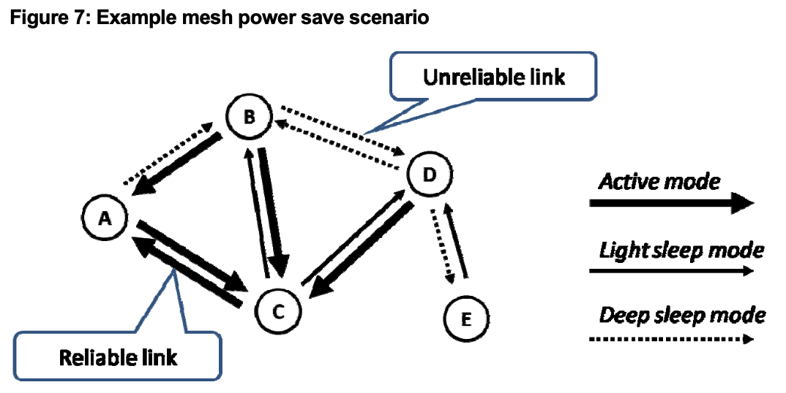

# 802.11s whitepaper reading notes

> This is a reading notes of "802.11s Mesh Networking Whitepaper" published by cwnp

## Why mesh networks

To use a wireless link to replace some Ethernet cables brings many benefits:

- Flexibility

  - Deployment ( obviously )

  - Path choosing. Multiple APs may be in range, and it can choose best radio path.

  - Redundant connection

    

- Self forming. With the embedded algorithm, building and expanding  is simple

- Self-healing. Removing one AP in mesh cloud forces others to find the new best path to wired network, without manual redeploy

## 802.11s architecture

### Definitions

- **station (STA)**: Any device contains IEEE 802.11-conformant MAC and PHY interface to the wireless medium (WM)
- **AP**: Any entity that has STA functionality and provide access to distribution services, via WM for associated STAs
- **mesh facility**: The set of everything used to provide data transfer among STAs
- **mesh station**: A QoS STA that implements the mesh facility, and is capable of participating in a mesh cloud, or **MBSS**
- **mesh gate**: Any entity has mesh STA functionality and provides access to one or more distribution systems, via the wireless medium (WM) for the MBSS
- **mesh BSS (MBSS)**: A BSS forms a self-contained network of mesh STAs, and contains zero or more mesh gates. And it's the official name of the mesh cloud
- **portal**: The logical point provides integration service
- **mesh coordination function (MCF)**: A coordination function that combines aspects of the contention-based and scheduled access methods. The MCF includes the functionality provided by both **enhanced distributed channel access (EDCA)** and **MCF controlled channel access (MCCA)**

### Architectural overview

An MBSS is an 802.11 LAN consisting of autonomous STAs. They estbalish peer-to-peer wireless links and transfer messages mutually.

All STAs appears as one Layer 2 group of devices. STAs in a MBSS might be sources, sinks or propagators of traffic, depending on the direction of traffic.

Mesh STAs don't communicate with non-mesh STAs - "mesh STA" is just a function, **it can be integrated with other function (such as AP)** to allow for 802.11 client device associations. MBSS can interconnect with infrastructure BSSs through the Distribution System (DS). Then, mesh STAs can communicate with non-mesh STAs through DS.

**DS** is a logical component and not necessarily a separate medium like Ethernet. It handles address to destination mapping. It "distributes" frames from one interface to another. For example, a frame from a client on 2.4GHz radio to a client on 5GHz radio, or to wired network, or to an MBSS on 5GHz radio.

**AP** is a STA that provides access to the distribution services via wireless medium for associated STAs. AP commonly performs the portal function.

**Portal** is the function (logical point, not physical) that translate traffic between the wireless to the wired network.

**Mesh gate** is the logical point translates mesh MSDUs to and from a non-mesh 802.11 DS and format. (MSDU = MAC Service Data Unit. the payload of an 802.11 data frame)

## Forming the mesh: discovery, peering, security

### Discovery

The discovery process uses the standard active and passive scanning mechanisms. The STAs in an MBSS send beacons and answer to probe requests with probe response.

The mesh STAs broadcasts and probes contain a **mesh profile**, which specifies the attributes of an MBSS. **All STAs in the same MBSS use the same mesh profile, or they cannot establish a peering**.

A mesh profile consists:

- Mesh ID element - It can be an ASCII string, and uniquely identifies the MBSS, close to the SSID in concept.
- Mesh configuration element - It contians several subfields that describe the mash capabilities of the local mesh station. Contains:
  - Path selection protocol identifier: which protocol is used to determine the best path
  - Path selection metric identifier: the metric used to calculate the best path
  - Congestion control mode identifier: the protocol used to management congestion in MBSS
  - Synchronization method identifier: sync method among mesh STAs
  - Authentication protocol identifier: authentication method and protcol used among mesh STAs
  - Mesh Formation Info element: how many peers the local STA has, and if the STA is connected to wired network or to a mesh gate
  - Mesh Capability element

Note: Mesh beacons are sent independently from standard 802.11 beacons.

### Peering

Two neighor mesh STAs establish a mesh peering to each other after discovery. They become **peer mesh stations** and can communicate directly after peering. One STA can have multiple peers.

Peering mechanism is to be a distributed, non-hierarchical, and non-exclusive agreement to communicate. Two peering models:

- Authenticated Mesh Peering Exchange (AMPE) - the secured peering mode
- Mesh Peering Management (MPM) - unsecured peering mode. This can only be used when security is not enabled.

Peering uses **Mesh Peering Open frames, Confirm frames and Close frames** to establish, manage, and tear down peering.

The peering process has to occur both ways: each side has to offer attributes, and confirm the peering. Any sequence of operation is allowed, but the process must be bidirectional to be complete.

Peering is then maintained as long as STAs are in range each other and share the same mesh profile.

### Securing Mesh Peers

## Selecting and maintaining the best path while allowing nodes to doze

### Finding the best path

Concepts:

- Path Selection: Finding a way to reach a given destination (wired network, or any other reachable MAC through MBSS)

- HWMP - Hybrid Wireless Mesh Protocol: The default path selection protocol that mesh STAs must implement. Along side of it, vendor can also define properietary method

- HWMP provides both proactive path selection and reactive path selection.

- Terminology used with path determination

  

- HWMP Mesh Path Selection frames : The specific frames that used for path management. These frames are action frames with Action category 13 (mesh) and subtype 1 (HWMP Mesh Path Selection)

  - This kind of frame contains several IEs (Information Elements). All IEs are optional and presence depends on the type of action the frame is intended to accomplish:
    - Path Request element (optional element 3)
    - Path Reply element (optional element 4)
    - Path Error Element (optional element 5)
    - Root Announcement element (optional element 6)
  - Path discovery relies on Path Requests (PREQ) and Path Replies (PREP). If mesh STA A needs to discover the path to mesh STA D, STA A sends PREQ frames to all mesh stations in range.
    - PREQ element is 37 ~ 352 bytes long, contains subfields:
      - PREQ originator's MAC address. This will be transmitted along with the frame
      - Originator HWMP Sequence Number: It identifies the request sent by the originator. each STA can check if the request was already received.
      - Path discovery ID: It is used to identify the path that the originator is trying to build.
      - Time To Live (TTL) & Life Time: Present to avoid loops. TTL is the number of hops. Each STA on path decrements this field by 1. Life Time plays the same role but is expressed in TUs
      - Hop count to the originator: Each STA on the path increments it. It allows each STA to determine its hop count to the originator. and also used for loop prevention.
      - metric: shows the total metric to the originator. It is modified by each STA on the path. Any receiving STA determines its metric back to the originator by taking this value, and by adding its own metric value to the emitting STA（应该是说把上一跳 STA 到自己的 metric 也加进去）
      - target count: the originator may need to discover a specific STA MAC address, or can proactively discover several of its neighbors. A mesh STA can use PREQ process to discover up to 20 other mesh STAs
      - target address: the broadcast MAC address or a specific MAC address.
      - target specific HWMP Sequence Number: the last known HWMP sequence number to that target

- HWMP Mesh Path Selection frame containing a PREQ may be rejected. That mainly because the receiving STA has no path to the intended destination, replies a Path Error(PERR) message in such case. PERR identifies the target address, the HWMP sequence number and provides the rejection reason 

  - When a station has a path to destination, this station accepts the frame and replies with a frame containing PREP element.
    - PREP element is 31 ~ 37 bytes long, contains subfields:
      - **target MAC address** and the associated target HWMP sequence number: used to identify the target and the message used to discover it
      - **Hop count to the target**: allow the originator to know how far the target is, from the responding station standpoint
      - **Metric** to the target: originator combines it with hop count to determine the best path
      - **Time To Live** (TTL) & Life Time field: like the ones in PREQ, but set by the responding STA

- Originator obtains the information of best path to destination after this process.

  

  A is trying to discover a path to STA H.

  1. A sends a PREQ received by mesh STAs in range of STA A - B, D, E. All STAs examine the PREQ and decide to accept it
  2. Since PREQ's target address is H, B, D, E cannot reply with a PREP (Only target can reply that. Unless the target is a broadcast address, that means one STA tries to discover its neighbors).
     B, D, E decrements the TTL & life time, and changs Hop Count and Metric to the Originator fields.
  3. B, D, E forward the PREQ via radio. C, F, G receive the PREQ. A also receives the PREQ forwarded by BDE, and since B, E also in range of D so D got PREQ from B, E again. 
  4. A, D would found this PREQ is the bounced one through checking HWMP sequence number, TTL and Life Time values, and they would discard the message. STAs only forward when HWMP sequence number is new, or the PREQ has a lower TTL and Life Time than the previous one when the sequence number is the same
  5. In this chain, F received the PREQ three times - from D, J and C. Suppose F received the PREQ from C first and forwarded that PREQ. When F received the PREQ from D, the PREQ contains the same sequence number but a better hop count to the originator, then F learns that this is a better path to A and forwards the second frame. If PREQ from D came first, F will discarded the one from C since it has a higher hop count to A.
  6. Finally, H receives the PREQ, and H answers the PREQ with a PREP, and PREP is sent back along the best path to the originator. If PREQ from J came first, H may answer to J, but eventually, as H receives a "better PREQ"(with lower metrics and hop counts back to A), the PREP will be forwarded  through F, D and A, and A will learn the best path to H

  STAs on path (for example D) will remember it is on the best path from A to H (identified by the components of PREQ), and remember the next hop and precursor

  If a path get disrupted (a station on the path loses its path to target), a PERR is generated at link break and propagated towards the originator, allowing it to generate a new path to target.

- When a mesh STA starts, it peers with its neighbors and immediately broadcasts PREQs using the broadcast address as the target address and All STAs will answer, allowing the new one to discover its MBSS. In 802.11s, you don't need to create any hierarchy for the MBSS and each mesh STA can discover all the others dynamically. 

- If you think it's too noisy, you can also designating (configuring) some STAs as **Root Mesh APs** . They are commonly the meth gates/portals. This allows you to organize the mesh cloud.

  - Root Mesh AP starts sending Root Announcement messages (RANN). RANN element transmitted in an HWMP Mesh Path Selection frame and has a length of 21 bytes. It contains:
    - **Root mesh AP MAC address**
    - a bit indicating if the root mesh AP is a gate
    - a **HWMP sequence number**, to identify this RANN
    - **Interval field**, indicating (in TUs) how often the mesh root AP is sending the RANN message (TU=Time Unit, a measurement of time equal to 1024 microseconds)
    - **Time To Live** (TTL) value, it will be decremented by each station transmitting the RANN. The TTL is used for loop prevention.
    - **Hop Count** and **Metric** fields, modified by STAs forwarding the RANN so that each STAs knows the distance to the root mesh AP.
  - It periodically propagates a RANN into the network. Information inside it is used to disseminate path metrics for STAs to reach the root mesh STA, but does not "estbalish a path"

### The Mesh Metric

hop count and metric are used for best path determination.

hop count counts the number of STAs between the local STA and the target destination. But this is not enough for determining the best path. and mesh uses metric to complement it.

metric is a combination of data rate and bit error rate. **Airtime link metric**. Vendors can combine both values to determine the best path

### A new frame format: up to 6 MAC addresses

- STAs start forwarding frames once path established

- Mesh frame contains 6 addresses:

  - 1: Receiver Address (RA)
  - 2 : Transmitter Address (TA)
  - 3: Mesh destination address, the target mesh STA (may or may not be the frame's ultimate destination)
  - 4: Mesh source address, the mesh originator (may or may not be the frame's ultimate source). When this is not used (e.g. management frames) the mesh source address can also be inside the Mesh Address Extension field
  - Inside the Mesh Address Extension subfield of  the Mesh Control field, address 5 is the final destination and 6 is the original source. They may be identical to 1 or 2 of 4 address above, if  the original source and / or final destination are mesh STAs. When 4 is not used, Mesh Address Extension field can host the mesh source address.

  

### Power management concerns

Three states related to power consumption:

- Active Mode: STA is available at any time to participate all activities. operates in 802.11 Awake mode
- Light Sleep Mode: STA alternates between Awake and Doze states. It can doze, then awake to receive the Beacon frame from peers (seems can be controled by Beacon frame in some ). Close to APSD mode in 802.11. 
- Deep Sleep Mode: STA does not monitor peers. STA awakes at a regular interval to send its messages(beacons for example), then stay awake for a while to get others' message

STA will communicate the power state with neighbors

- Beacon and probe response contains **Mesh Awake Window** IE, specifies awake window duration in TUs. STA can send frame only during the window.

- It can be set differently for different neighbor (non-peer, peer, peer-specific). STA can decide to change its power status for a given neighbor. For example, A has two paths to D, one through B and another through C, and B seems less reliable than C. Then STA A can decide to stay in Active mode with C but announce to B a deep sleep mode, forcing B to buffer its frames for A.

- The same logic can apply to any other link.

  

  - B and D are in deep sleep mode (to each other) - they decide not to use their link.
  - D active with C - D is available for any frame from C
  - C announced a Light Sleep mode to D and B - C will wake up for B and C beacons to check if they have any buffered traffic

- In extreme scenariaos, a STA can declear itself in deep sleep mode for all neighbors - this STA never forward traffic, only be active in the MBSS for its own traffic.

 

## Managing Collisions and Traffic Priorities

QoS and collisions are two major concerns in mesh networks. But neighbors can work together to reduce collisions and congestion

### Synchronization mesh stations time

Neighbor Offset Synchronization - this mechanism relies on the fact that beacons and probe response frames contain a timestamp, which expresses the local time at the emitting STA. The timestamp is used to calculate the **neighbor clock drift** - by comparing the received timestamp to the expected one

- The receiving STA can get the time difference by easily compution
- When A send another beacon, the difference is 1 ms less than the previous beacon difference, this means that both STA's clock do not run at the same speed. 

### Anti-collision mechanism for beacon frames, MBCA

Clock synchronization can be used for here - to avoid beacon collisions, using a purpose called **Mesh Beacon Collision Avoidance (MBCA)** . In Figure 8, A and C may not be in range, and are transmitting frames to B at the same time. Beacon frames are very likely to collide because they are unsolicited frames, send very often. Mesh STAs use **Beacon Timing Element** IE, containing neighbor ID, target beacon transmission time (TBTT) and the beacon interval (in TUs) for this neighbor, for each detected neighbor.

Each STA must take this information in account for its own beacons. For example, C will receive beacons coming from STA B and therefore learn about A's TBTT and beacon interval. Time is adjusted with drifts, so C can determine exactly.

*MBCA only applies to beacons

### Prioritizing frames at the scale of the entire mesh cloud

802.11 standard - Enhanced Distributed Channel Access (EDCA) implements prioritization mechanisms for STAs using **Distributed Coordination Function** (DCF), the standard contention-based medium access function.

MBSS medium access function - **Mesh Coordination Function** (MCF), it implements the additional functions detailed in the previous pages. MCF also implements EDCA for contention-based channel access and a contention-free channel access mechanism MCF controlled channel access (MCCA). Because mesh backhaul on a mesh deployment will most likely be controlled by one single vendor, it's possible for that the vendor to fine true MCCA to offer prioritization with the best performance.

Each STA can enable and show its MCCA support by setting to 1 the **MCCA Enabled bit** presented in beacons and probe responses

MCCA-enabled STAs use management frames to make reservations for transmissions. STA transmits an **MCCA Setup Request** frame to initiate medium reservation. Then this STA becomes **mesh coordination function controlled channel access opportunity (MCCAOP) owner** of the MCCAOP reservation

