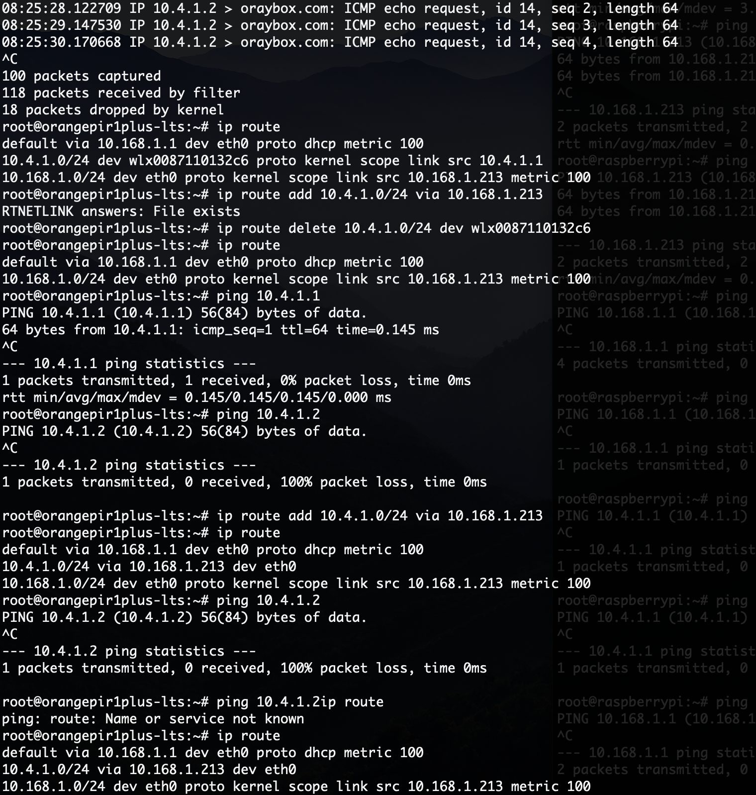
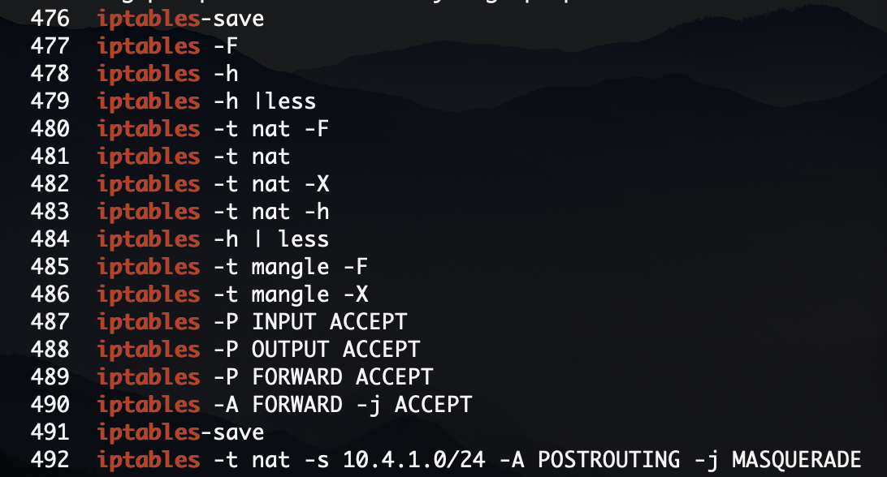
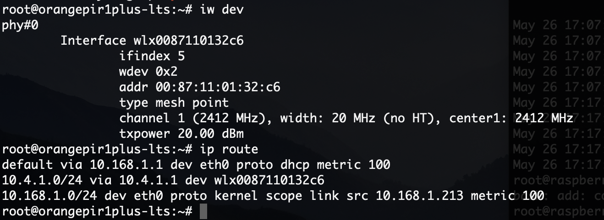
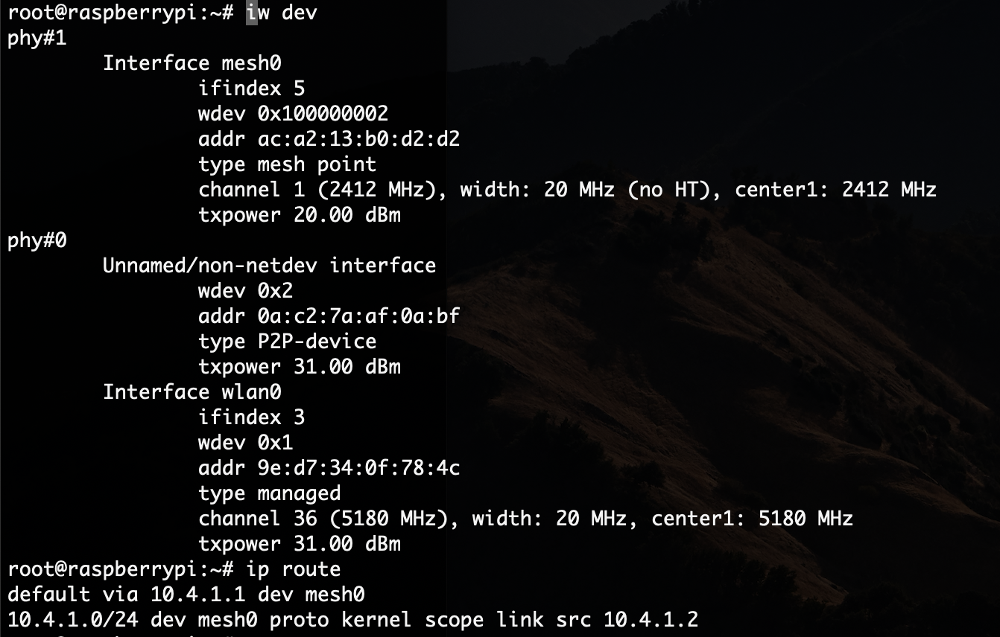

[How To Configure batman-adv on the Raspberry Pi 3 : darknetplan (reddit.com)](https://www.reddit.com/r/darknetplan/comments/68s6jp/how_to_configure_batmanadv_on_the_raspberry_pi_3/)

[How to Setup a Raspberry Pi Ad-Hoc Network Using BATMAN-ADV on Raspbian Stretch | by Tyler Doll | Medium](https://medium.com/@tdoll/how-to-setup-a-raspberry-pi-ad-hoc-network-using-batman-adv-on-raspbian-stretch-lite-dce6eb896687)

[Mesh networking: A guide to using free and open-source software with common hardware - CGomesu](https://cgomesu.com/blog/Mesh-networking-openwrt-batman/#software)

[batman-adv — The Linux Kernel documentation](https://www.kernel.org/doc/html/v4.15/networking/batman-adv.html)

[OpenWrt Wiki - B.A.T.M.A.N. / batman-adv](https://openwrt.org/docs/guide-user/network/wifi/mesh/batman)

[binnes/WiFiMeshRaspberryPi: Workshop to create a sensor application over a WiFi Mesh network (github.com)](https://github.com/binnes/WiFiMeshRaspberryPi/tree/master)

[OpenWrt Wiki - 802.11s Based Wireless Mesh Networking](https://openwrt.org/docs/guide-user/network/wifi/mesh/80211s)

[OpenWrt Wiki - The Mesh11sd Project](https://openwrt.org/docs/guide-user/network/wifi/mesh/mesh11sd)

[WiFi Mesh in Linux – SimpleBlogs (wordpress.com)](https://kasiviswanathanblog.wordpress.com/2021/02/04/wifi-mesh-in-linux/)

Kernel wireless driver support matrix: https://wireless.wiki.kernel.org/en/users/Drivers

[How it works (libremesh.org)](https://libremesh.org/howitworks.html)

[How to check Network Interface details in Linux - blackMORE Ops](https://www.blackmoreops.com/2021/09/06/how-to-check-network-interface-details-in-linux/)

[Ath10k mesh - linux wireless](https://wireless.wiki.kernel.org/en/users/drivers/ath10k/mesh)

[Backporting Linux Kernel driver to an older kernel (site.com)](https://microchip.my.site.com/s/article/Backporting-Linux-Kernel-driver-to-an-older-kernel)

[Driver Backports Wiki (kernel.org)](https://backports.wiki.kernel.org/index.php/Main_Page)

[wireless/wifi/mesh – Gateworks](http://trac.gateworks.com/wiki/wireless/wifi/mesh) (Bring up mesh interface using wpa_supplicant)

iptables, implement nat: [Configure Linux as a Router (IP Forwarding) | Linode Docs](https://www.linode.com/docs/guides/linux-router-and-ip-forwarding/#enable-ip-forwarding)

when finish these, everything just goes well.

steps:

1. Setup mesh point interfaces
2. Setup mesh 
