# How to build a simple but usable mesh

Author: Jingwei LI

Date: May 28th 2023

This document will help you to build your own mesh cloud, step by step. 

We using the "generic linux" here instead of OpenWRT

## Select the right hardwares

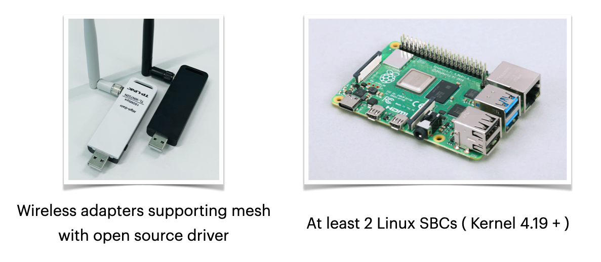

The wireless NICs selected should meet two requirements at the same time:

- Support the "mesh point" working mode
- Provide reliable driver for Linux, including mesh working mode support

You can check the driver feature matrix provided at [Linux Wireless Drivers Page](https://wireless.wiki.kernel.org/en/users/Drivers) to find the suitable product, this is the most efficient way to find suitable NICs.

The NIC that supporting mesh mode with open source driver is very rare, what makes things worse is that the performance and stability differs in different versions of Linux kernels, so the adapter should be choosen and tested carefully. The adapters on the left picture is what I am using now. One is using ath9k_htc NIC from Atheros, another is using RT3070 NIC from MediaTek, they works well with Raspberry Pi 4 and Orange Pi R1 Plus

Besides network adapter, we need at least 2 Linux SBCs (Single Board Computers), using the Linux kernel with a minimal version of 4.19. The linux wireless modules had a big change since version 4.19, which make the driver back porting very difficult, I tried and I gave it up.

> If your device is using an older kernel, or your kernel is simplified by manufacture, you can try the [Linux Backports](https://backports.wiki.kernel.org/index.php/Main_Page) , which brings the newer driver to older kernel. 
>
> But there's no guarentee for it to work. you may still suffer from build errors when building the kernel modules.

You can use `iw phy` to check if your NIC supports the mesh mode, all interface modes your NIC support will be contained in that output's "Supported interface modes" section:

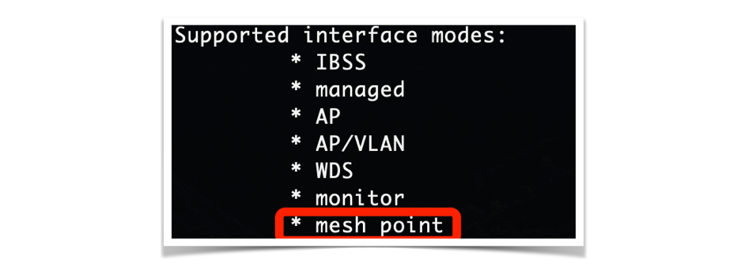

## Make the deployment plan

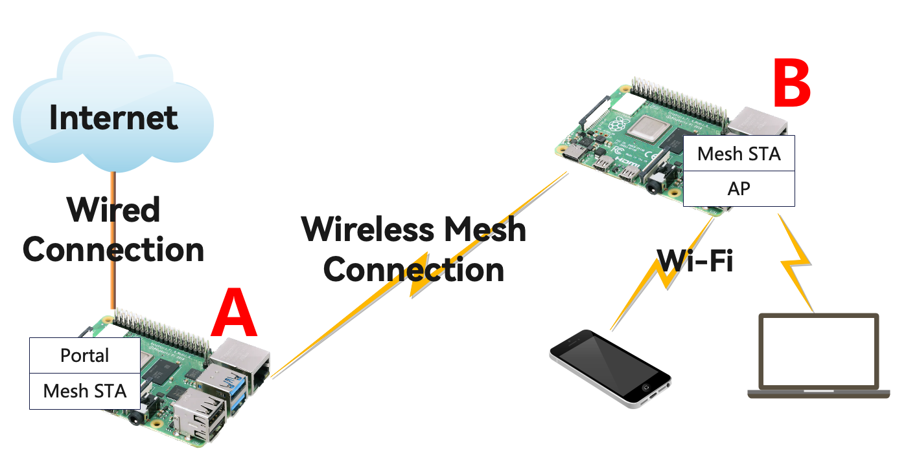

> Mesh Portal: the gateway between the wireless mesh network and wired network
>
> Mesh STA: the device using mesh services to communicate with other devices
>
> AP: Access Point, providing Wi-Fi connecting service for clients
>
> Note: "mesh network" only provides layer 2 connection, so you need to use it with other components to achieve different functionalities. For example Mesh + AP = AP providing network via mesh cloud, and Mesh + Portal can connect the mesh cloud to the outside world.

This is our deployment plan. We will connect A to the Internet, and make a mesh connection to B, B will act as Access Point providing Wi-Fi signal for users, while B itself have no direct Internet connection.

And the following figure shows the IP address plan

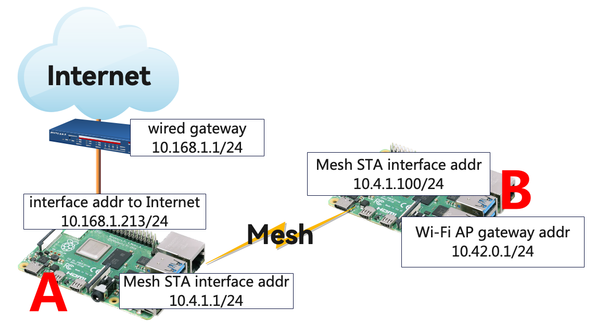

The "wired gateway" is the router that providing wired Internet connection for the mesh, it assigned the IP address `10.168.1.213/24` for our mesh portal A.

For any mesh devices in the mesh network, A's mesh STA interface address is 10.4.1.1/24, this address is also the gateway to outside world.

As the mesh STA that provides Wi-Fi AP service, B using 10.4.1.100/24 to be its mesh STA interface address, and using 10.42.0.1/42 as its Wi-Fi AP gateway interface address.

## Establish mesh association

You should do following operations on both SBCs

### Configure wireless adapter working in mesh mode

First, we need to check if the interface is already configured to "managed" mode by other services, by using `iw dev` command:

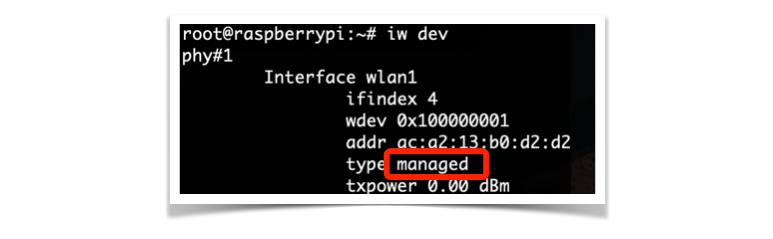

If it is, we need to delete it first, using `iw dev <interface-name> del` command:


Now the "wlan1" interface is gone.

Then we can configure this physical device into a "mesh point" mode interface, by using command:

```
# iw phy <phy> interface add <mesh-interface-name> type mp
```

For example:

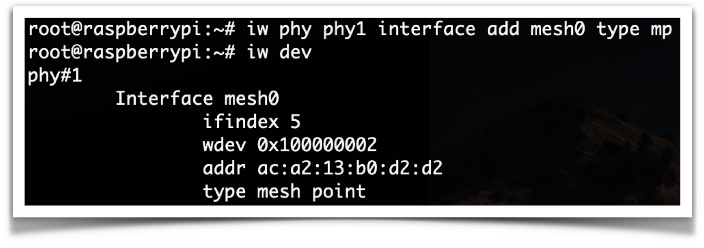

> Note: if the newly created interface type is still "managed", it means that this physical device is managed by other services like NetworkManager. You can set the NetworkManager do not manage it (see this document from redhat: [Configuring NetworkManager to ignore certain devices](https://access.redhat.com/documentation/en-us/red_hat_enterprise_linux/8/html/configuring_and_managing_networking/configuring-networkmanager-to-ignore-certain-devices_configuring-and-managing-networking)). Or you can simply stop the NetworkManager service if you sure you don't need it, by using command:
>
> ```
> # systemctl stop NetworkManager
> ```
>
> And for some reasons that I don't know yet, the interface name always changes automatically. In that case, just use the changed interface name in all the following steps is ok
>
> 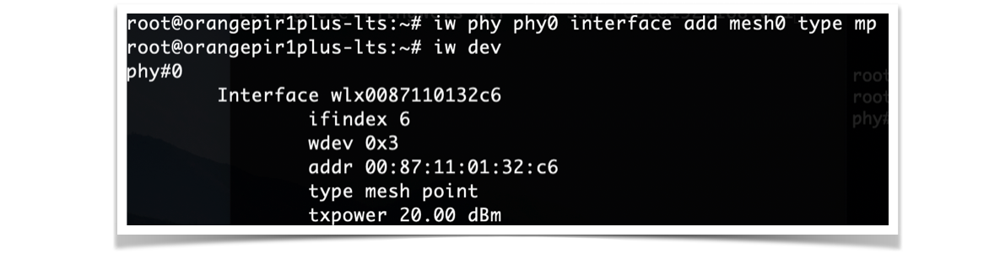

### Assign IP address for mesh interface

This step is simple, just using `ip address add` command is ok. Then you can check it with `ip address show` command

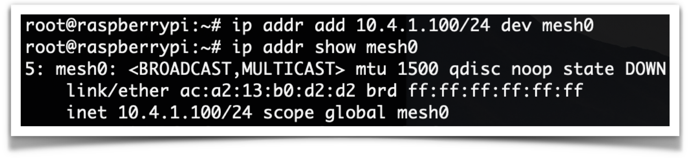

### Bring the mesh interface up and join an MBSS (Mesh Basic Service Set)

The following commands are bringing the interface up, and creating a MBSS called "jingweili-mesh"

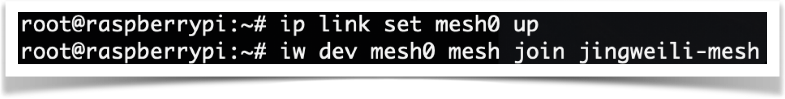

Once this command is executed on both SBCs successfully, you can check the peering status with `iw station dump` command:

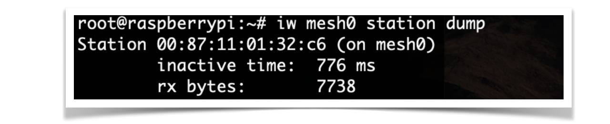

And now they should be able to ping each other. Because they can see each other on layer 2 and in the same subnet, they can broadcast ARP requests and got reply

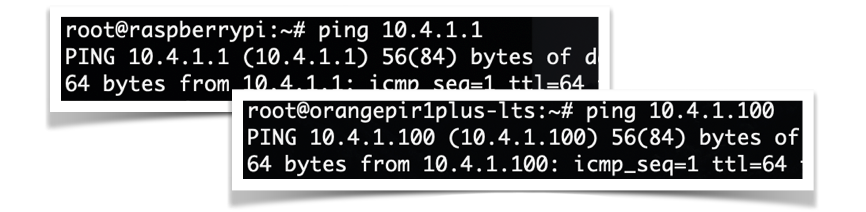

## Connect AP SBC to Internet

Let's have a look at the IP topology plan again


Because A is the gateway for the internal mesh network, so firstly we need to add a route for B, making it know that if it want to reach address other than 10.4.1.0, should via the gateway 10.4.1.1, which is A

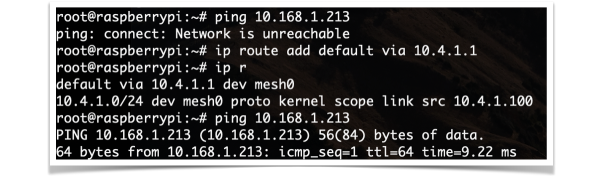

Then we configure the sysctl and iptables, to enable IP forwarding. We need to edit A's `/etc/sysctl.conf` file, to enable IPv4 forwarding (set the value to 1 to enable it)


And apply it by running command `sysctl -p /etc/sysctl.conf`. The options printed on screen means the newly updated options

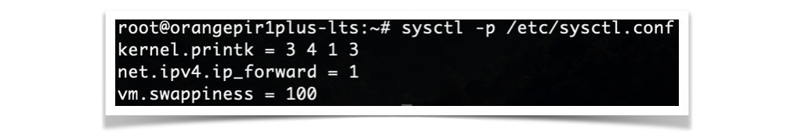

Then we need to do a series of iptables configurations on A about the IP forwarding

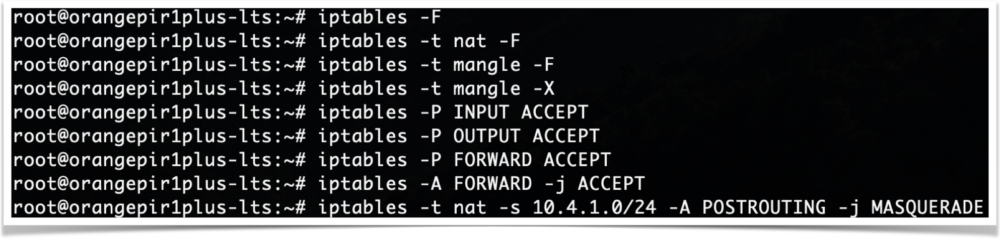

Now, B should be able to ping 10.168.1.1, which is the main gateway for our network. And after configuring the right DNS, B should be able to ping Internet domains

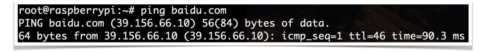

## Setup Access Point

Thanks to RedHat's NetworkManager, this is the easiest step.

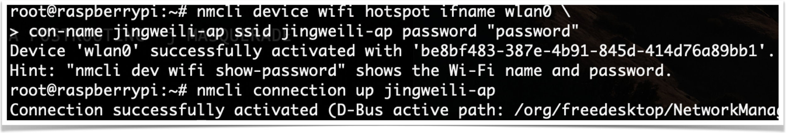

And, that's done! Enjoy your mesh cloud!

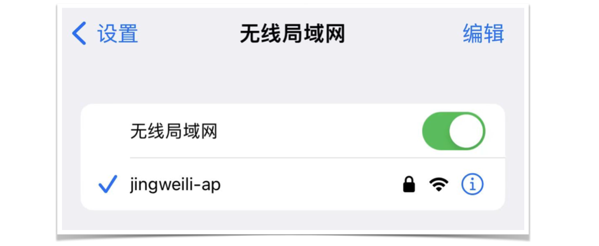


## My Actual Deployment

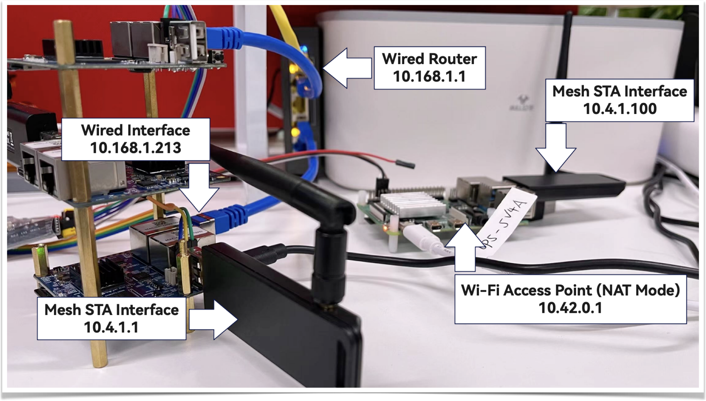

