# Linux 虚拟网络接口

Linux 能够通过虚拟网络接口为虚拟机、容器、云环境等提供丰富的支持

> 本文主要内容翻译、删改自 https://developers.redhat.com/blog/2018/10/22/introduction-to-linux-interfaces-for-virtual-networking

## Bridge

Linux bridge 和交换机很像，其能够为连接到它的接口转发数据包。Bridge 通常用于在路由器、网关以及主机的 network namespace 或虚拟机之间转发数据包。也支持 STP, VLAN 过滤器以及 multicast snooping

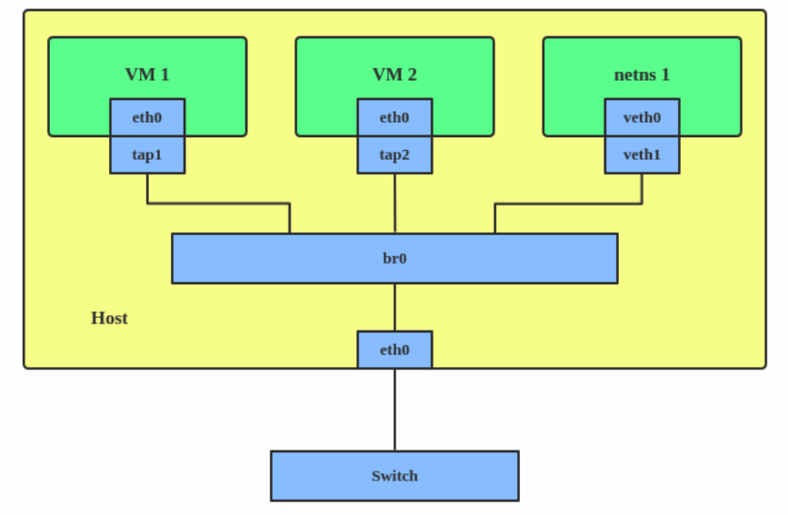

想要在虚拟机、容器和 host 之间建立通信的时候就可以用 bridge。建立方式如下：

```
# ip link add br0 type bridge
# ip link set eth0 master br0
# ip link set tap1 master br0
# ip link set tap2 master br0
# ip link set veth1 master br0
```

上面这些命令会建立一个网桥 `br0` ，然后把两个 TAP 设备、一个 veth 设备以及一个物理设备 `eth0` 作为 slave 接入网桥

## Bonded interface

Linux bonding driver 能够将多个网络接口合并为单一的逻辑 "bonded" 接口。bonded 接口的行为取决于为其设置的模式，通常来说会被设置为 hot standby 或 load balancing service

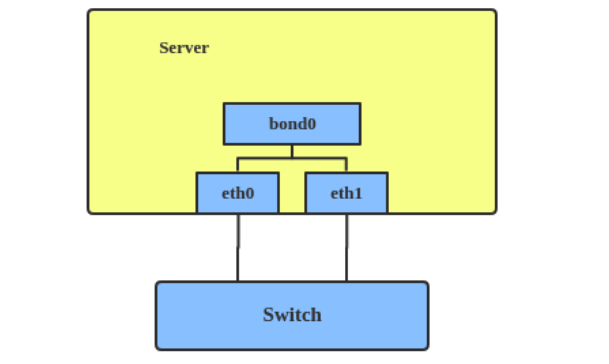

当要为服务器提升连接速度或做 fallover 时，可以用到 bonded interface 。创建方式：

```
# ip link add bond1 type bond miimon 100 mode active-backup
# ip link set eth0 master bond1
# ip link set eth1 master bond1
```

这会创建一个 active-backup 模式的 bonded interface `bond1` 。更多模式相关信息，参阅 https://www.kernel.org/doc/Documentation/networking/bonding.txt

## Team device

与 bonded interface 类似，team device 的价值在于能够在 L2 层将多个网卡（接口）合并为一个逻辑接口（teamdev）。

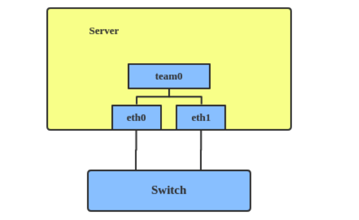

team device 使用了不同的方式（例如无锁（RCU）TX/RX 路径及模块化设计）来解决与 bonded interface 相同的问题。此外也有一些功能上的差异。例如 team 支持 LACP load-balancing，NS/NA (IPV6) link monitoring, D-Bus 接口等 bond 没有的功能。详细对比参阅[Bonding vs. Team features · jpirko/libteam Wiki (github.com)](https://github.com/jpirko/libteam/wiki/Bonding-vs.-Team-features)

当要使用 bonded interface 没有的功能时，可以用 team device。创建方式如下：

```
# teamd -o -n -U -d -t team0 -c '{"runner": {"name": "activebackup"},"link_watch": {"name": "ethtool"}}'
# ip link set eth0 down
# ip link set eth1 down
# teamdctl team0 port add eth0
# teamdctl team0 port add eth1
```

上述命令创建了一个 `active-backup` 模式的 team interface `team0` ，并把 `eth0`, `eth1` 设置为了它的子接口。

最近 Linux 添加了一个叫做 "net_failover" 的新 driver ，这是另一种为虚拟化提供的 failover master 网络设备，其管理一个 primary ( [passthru/VF](https://wiki.libvirt.org/page/Networking#PCI_Passthrough_of_host_network_devices) 设备) slave 网络设备和一个 standby (原来的半虚拟化接口) slave 网络设备

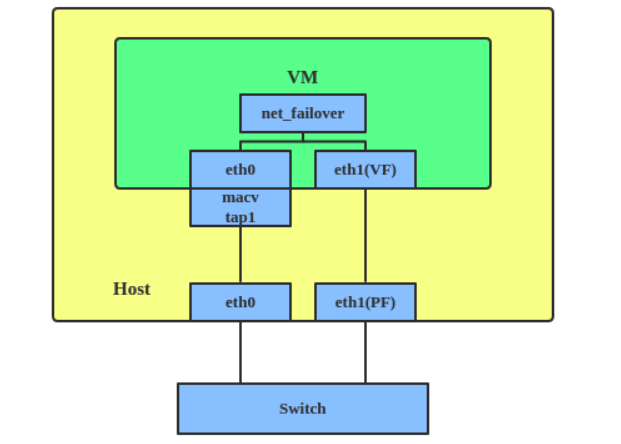

## VLAN （虚拟 LAN）

VLAN 通过在网络数据包中添加 tags 的方法将广播域（broadcast doamins）分开。VLAN 允许网络管理员将同一个交换机或不同交换机之间的多个 host 划分为一组。VLAN 头如下：

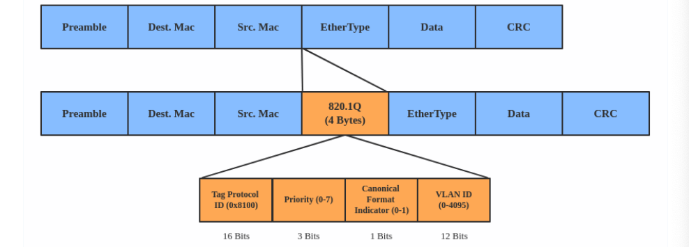

VLAN 可用于将多个虚拟机、namespace 或 host 划分为不同的子网。创建方式如下

```
# ip link add link eth0 name eth0.2 type vlan id 2
# ip link add link eth0 name eth0.3 type vlan id 3
```

上面的命令创建了名为 `eth0.2` 的 VLAN 2 和名为 `eth0.3` 的 VLAN 3。拓扑图如下所示

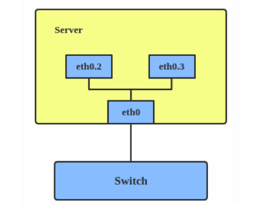

注意：当配置 VLAN 时，应确保连接到 host 的交换机能够处理 VLAN tags 。比如将交换机端口设置为 trunk mode

## VXLAN

VXLAN（Virtual eXtensible Local Area Network）是用于解决 IEEE 802.1q 中 VLAN ID 不够用（4096个）问题的隧道协议。

VXLAN 使用 24 位长的段 ID （VXLAN Network Identifier, VNI）来支持 2^24 个虚拟 LAN。其对 L2 帧进行封装，把 VXLAN 头加入了 UDP-IP 包中，看起来是下面这样的：

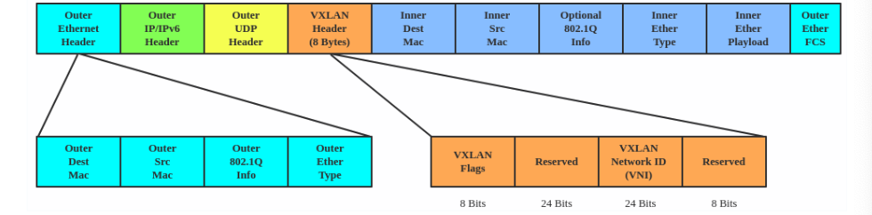

VXLAN 通常会被部署在数据中心的虚拟化 hosts 上，这些 host 可能分布在不同的机架上

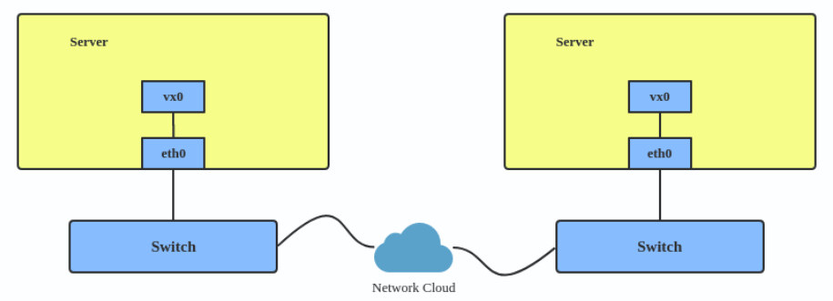

创建方式：

```
# ip link add vx0 type vxlan id 100 local 1.1.1.1 remote 2.2.2.2 dev eth0 dstport 4789
```

详请参阅 https://www.kernel.org/doc/Documentation/networking/vxlan.txt 、[VXLAN & Linux (bernat.ch)](https://vincent.bernat.ch/en/blog/2017-vxlan-linux)

## MACVLAN

VLAN 可以让我们在一个接口上创建多个接口，并根据 VLAN 标签来过滤数据包。而 MACVLAN 则可以在一个接口上创建使用不同 L2 （即 Ethernet MAC）地址的多个接口。

在 MACVLAN 出现之前，把 VM 或 namespace 连入物理网络需要借助 TAP/VETH 设备，然后把它们和物理接口接到同一个网桥上，如下

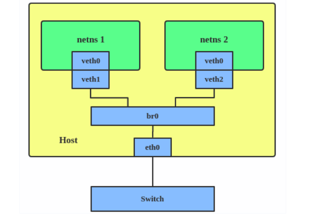

使用 MACVLAN，就可以把一个与 MACVLAN 关联的物理接口直接绑定到 namespaces ，而无需通过网桥

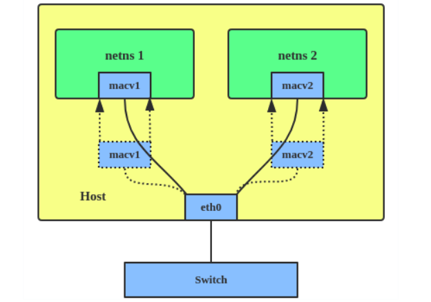

一共有五种 MACVLAN 

1. Private : 不允许在同一个物理接口上多个 MACVLAN 实例之间的通信，即使外部的交换机支持 hairpin 模式也不行

   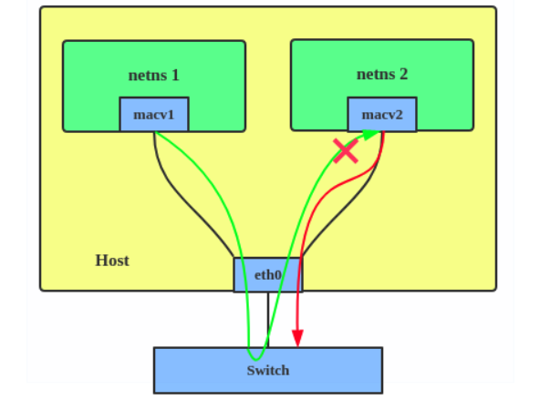

2. VEPA: 对于多个绑定在同一物理接口上的实例，他们之间的数据需要通过物理接口传输。但该模式需要外部支持——要么连接的交换机支持 hairpin 模式，要么有个 TCP/IP 路由器来转发数据包

3. Bridge：所有的端点都可以通过物理接口的网桥直接通信

   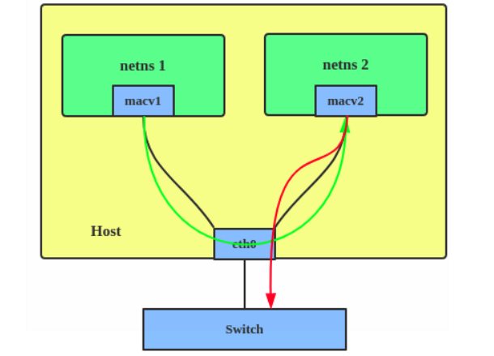

4. Passthru: 允许单个 VM 直接连接物理接口

   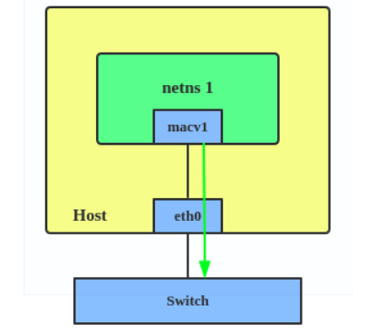

5. Source: source 模式用于过滤流量。该模式可以根据一个 source MAC 地址白名单来创建基于 MAC 的 VLAN 关联。详情参阅 https://git.kernel.org/pub/scm/linux/kernel/git/davem/net.git/commit/?id=79cf79abce71

这些模式中最常用的是 Bridge 模式。在想要直接将容器连到物理网络中的时候，可以使用 MACVLAN。设置方法：

```
# ip link add macvlan1 link eth0 type macvlan mode bridge
# ip link add macvlan2 link eth0 type macvlan mode bridge
# ip netns add net1
# ip netns add net2
# ip link set macvlan1 netns net1
# ip link set macvlan2 netns net2
```

这将以桥接模式创建两个新的 MACVLAN 设备，并将这两个设备分到分配到不同的 namespace

## IPVLAN

IPVLAN 与 MACVLAN 类似，区别在于端点拥有相同的 MAC 地址

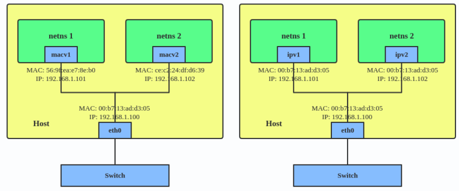

IPVLAN 支持 L2 和 L3 两种模式，IPVLAN L2 类似 MACVLAN 的桥接模式，父接口看起来像是一个网桥或交换机

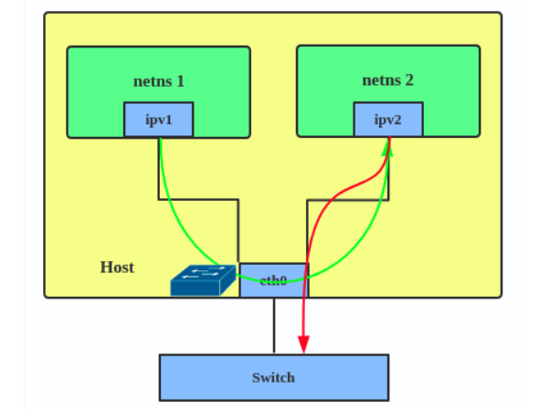

L3 模式的父接口看起来像个路由器，数据包会被在端点之间路由，能提供更强的可扩展性

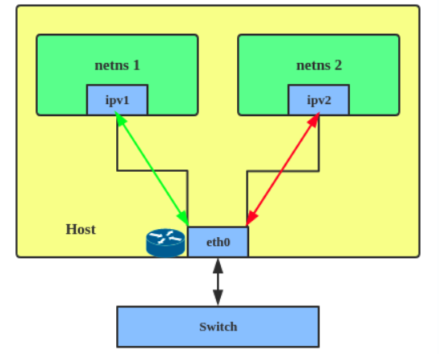

在需求中有下列要求的情况下，可以选择 ipvlan：

1. 连接到外部交换机/路由器的 Linux host 被配置为了每个端口只能有一个 mac
2. Master （主设备）上创建的虚拟设备没有超过 mac 限制，NIC 设置为混杂模式，且不能降低性能
3. 当 Slave 设备会被放入 hostile / 不信任的网络 namespace ，slave 的 L2 可能被修改或滥用时

创建 IPVLAN 实例的方法：

```
# ip netns add ns0
# ip link add name ipvl0 link eth0 type ipvlan mode l2
# ip link set dev ipvl0 netns ns0
```

上面的命令创建了一个名为 `ipvl0` 的 L2 模式 IPVLAN 设备，被分配给 namespace `ns0` 

## MACVTAP/IPVTAP

MACVTAP/IPVTAP 是一种新的设备 driver，能够用来简化虚拟桥接网络。当 MACVTAP/IPVTAL 实例创建在一个物理接口之上时，内核也会创建一个 character device/dev/tapX 设备，就像 [TUN/TAP](https://en.wikipedia.org/wiki/TUN/TAP) 设备一样，可以被 KVM/QEMU 直接使用。可以用单一的 MACVTAP/IPVTAP 模块替换掉 TUN/TAP 和网桥：

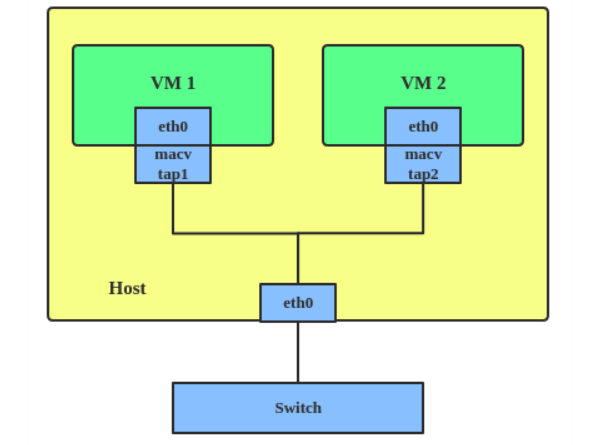

MACVLAN/IPVLAN 通常用于让 guest 和 host 同时直接出现在 host 连接的交换机上。MACVTAP 和 IPVTAP 之间的区别与 MACVLAN/IPVLAN 之间的区别相同

创建 MACVTAP 实例的方式：

```
# ip link add link eth0 name macvtap0 type macvtap
```

## MACsec - Media Access Control Security

MACsec 是在有线以太网 LAN 中使用的 IEEE 安全标准。其作为一个 L2 规范与 IPsec 类似，MACsec 除了保护 IP 流量之外也能保护 ARP 流量、邻居发现和 DHCP。MACsec 头如下：

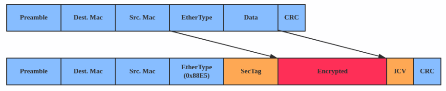

MACsec 用于保护标准 LAN 中的所有信息，包括 APR，NS 和 DHCP

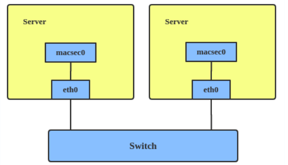

MACsec 建立方式如下：

```
# ip link add macsec0 link eth1 type macsec
```

注意：这只在 eth1 接口上建立了一个 MACsec 设备，更多的配置请参阅[MACsec: a different solution to encrypt network traffic | Red Hat Developer](https://developers.redhat.com/blog/2016/10/14/macsec-a-different-solution-to-encrypt-network-traffic)

## VETH

VETH （虚拟 Ethernet）设备是一个本地以太网隧道（tunnel），该类设备总是成对创建。发送到一个设备上的数据包将立即出现在与该设备成对创建的另一个设备上，这一对设备中任何一个 down 都会让整个设备对的状态为 down

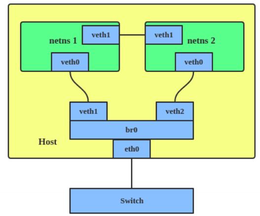

当要让 namespace 之间进行通信时，可以使用 VETH

配置方式如下

```
# ip netns add net1
# ip netns add net2
# ip link add veth1 netns net1 type veth peer name veth2 netns net2
```

这里创建了两个 namespace `net1` 和 `net2` ，以及一对 VETH 设备。 `veth1` 分给命名空间 `net1` ，`veth2` 分给命名空间 `net2` 。这两个命名空间都连接到 VETH 对。再为它们分配好 IP 地址，这两个 namespace 之间就可以通信了。

## VCAN、VXCAN

VCAN 提供虚拟本地 CAN （Controller Area Network）接口，用户可以通过 VCAN 接口来收发 CAN 消息。

创建方法

```
# ip link add dev vcan1 type vcan
```

VXCAN 是 Virtual CAN tunnel ，与 VETH 类似，在两个 VCAN 网络设备间实现通信。

创建方式

```
# ip netns add net1
# ip netns add net2
# ip link add vxcan1 netns net1 type vxcan peer name vxcan2 netns net2
```

## IPOIB

IPOIB 设备支持 IP-over-InfiniBand 协议，能够将 IB 设备作为高速 NIC 使用。IPOIB 协议的最大 MTU 是 64K。当要通过 IP 来让 IB 设备与远程主机通信时，可以借助 IPOIB

创建方法：

```
# ip link add ib0 name ipoib0 type ipoib pkey IB_PKEY mode connected
```

## NLMON

NLMON 是 Netlink Monitor device 。可用于监控系统的 Netlink 消息。创建方式：

```
# ip link add nlmon0 type nlmon
# ip link set nlmon0 up
# tcpdump -i nlmon0 -w nlmsg.pcap
```

这样一个 NLMON 设备 `nlmon0` 就被创建出来并启动了。可以用数据包嗅探器（比如 `tcpdump`）来捕捉 Netlink 消息

## Dummy Interface (假接口)

假接口是像环回接口一样的纯粹的虚拟接口。用于提供一个可以不进行实际传输就路由数据包的设备。

可以用假接口来让未激活的 SLIP（Serial Line Internet Protocol）地址在本地程序眼中看起来像是一个真实的地址。现在假接口通常用于测试和调试。创建方式如下：

```
# ip link add dummy1 type dummy
# ip addr add 1.1.1.1/24 dev dummy1
# ip link set dummy1 up
```

## IFB - Intermediate Functional Block

IFB driver 提供一个允许多个数据源流量汇集的设备，对入方向流量整型（shaping）而不是直接丢弃

当要对入方向流量进行排队及整型时可以使用 IFB。创建方法：

```
# ip link add ifb0 type ifb
# ip link set ifb0 up
# tc qdisc add dev ifb0 root sfq
# tc qdisc add dev eth0 handle ffff: ingress
# tc filter add dev eth0 parent ffff: u32 match u32 0 0 action mirred egress redirect dev ifb0
```

这将创建一个名为 `ifb0` 的 IFB 设备，并使用 SFQ （Stochastic Fairness Queueing，一个无分类排队调度器）替代 root qdisc 调度器。然后在 `eth0` 上添加一个 ingress qdisc 调度器并将所有的入方向流量重定向到 ifb0。详情参阅 https://wiki.linuxfoundation.org/networking/ifb

## 其他资料

- [Virtual networking articles](https://developers.redhat.com/search?t=Virtual+networking+articles) on the Red Hat Developer blog
- [Dynamic IP Address Management in Open Virtual Network (OVN)](https://developers.redhat.com/blog/2018/09/03/ovn-dynamic-ip-address-management/)
- [Non-root Open vSwitch in Red Hat Enterprise Linux](https://developers.redhat.com/blog/2018/03/23/non-root-open-vswitch-rhel/)
- [Open vSwitch articles](https://developers.redhat.com/search?t=Open+vSwitch) on the Red hat Developer Blog

## netdevsim interface

netdevsim 是一个模拟的网络设备，其可用于测试各种网络 API 。

创建方式：

```
# ip link add dev sim0 type netdevsim
# ip link set dev sim0 up
```

启用 tc offload

```
# ethtool -K sim0 hw-tc-offload on
```

加载 XDP BPF 或 tc BPF 程序

```
# ip link set dev sim0 xdpoffload obj prog.o
```

为 SR-IOV 测试添加 VF

```
# echo 3 > /sys/class/net/sim0/device/sriov_numvfs
# ip link set sim0 vf 0 mac 
```

若要修改 vf 数字，需要先完全 disable 它们

```
# echo 0 > /sys/class/net/sim0/device/sriov_numvfs
# echo 5 > /sys/class/net/sim0/device/sriov_numvfs
```

