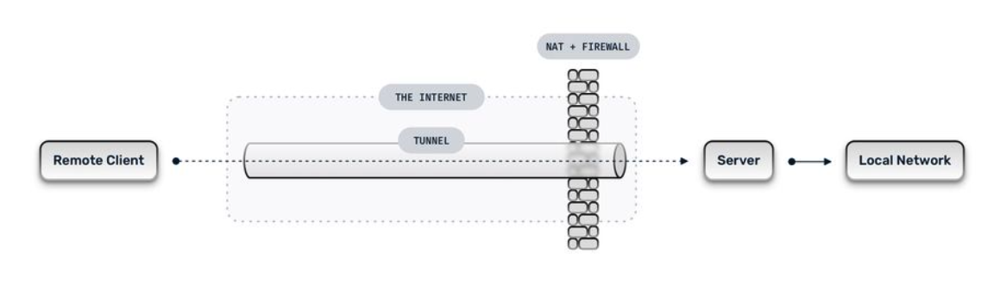

# hostapd

https://wireless.wiki.kernel.org/en/users/documentation/hostapd

hostapd 是一个 IEEE 802.11 AP 和 IEEE 802.11X/WPA/WPA2/EAP/RADIUS Authenticator。

hostapd 通过一些接口和内核驱动通信。所有基于新 cfg80211 （和 mac80211 ）开发、实现了 AP 功能的驱动都利用了 [nl80211](https://wireless.wiki.kernel.org/en/developers/documentation/nl80211) 接口提供的支持。

对于老一些的内核驱动，hostapd 使用了单独的驱动。在 Linux 上，有三个其他的驱动可以使用：

- HostAP
- madwifi
- prism54

mac80211 子系统将 master 模式全部移入了用户空间。具体如何认证客户端、设置加密密钥、建立密钥轮换策略（key rotation policy）以及无线基础设施（wireless infrastructure）的其他部分都由 hostapd 来决定。因此，通过 `iwconfig <wireless interface> mode master` 创建 AP 的方式也就不再有效了。但同时这也意味着 hostapd 这种用户空间程序需要新的方法来发送 / 接收管理帧（management frames）。

# nl80211 的一些细节

在过去，接收和发送管理帧都需要由 monitor 模式的接口来进行，那时需要一个运行 master 模式的接口来处理**标准(standard)**流量，还需要另一个单独的接口负责进行认证、密钥管理等工作。第二个接口可以使用标准的 Linux socket 进行读写，而不需要任何特殊的 API 。作为备份，nl80211 驱动仍然支持该方法。

后来，nl80211 实现了用于发送管理帧（NL80211_CMD_FRAME）与接收返回（NL80211_CMD_REGISTER_FRAME）的特殊命令。这样就可以在用户空间使用单一的接口来管理无线基础设施了。这是目前推荐的使用管理帧的方法，可以被用于所有实现 AP 模式的 mac80211 驱动

# 配置 hostapd

## 建立配置基线

在开始配置 hostapd 之前，需要先确定使用服务的客户端的能力——客户端的能力各不相同，因此需要先建立配置基线。最好也调查一下当地哪个信道上的 AP 最少。在选择信道时，需要记住任何信道之间的重叠范围都不会超过 20MHz 。

一些基线的样例：

```
加密: wpa-psk + tkip
无线模式: g
适合环境中有不支持 CCMP 或 WPA2 的设备
```

```
加密: wpa2-psk + ccmp
无线模式: g+n
适合只有新款软硬件设备的环境
```

```
加密: wep
无线模式: b
最糟糕的场景。WEP 能够被轻易破解。基本挡不住啥
```

建立完基线，就可以开始编辑 hostapd.conf 了。配置项可以分为三个部分

```
通用（common）选项: 基本都要设置的选项
附加（additional）选项: 可能会有用的选项。至少要知道有这些选项
额外（extra）选项: 在多数情况下可能不会用到的选项
```

## 通用选项（ Common Options ）

配置使用 nl80211 驱动的 hostapd 时最基本的选项已经以 `hostapd-minimal.conf` 的形式提供了。如果你不需要一直保持在同一个频道上，也不需要加密，也不需要自定义名称的话，只需要配置这里面的就可以了——不过在实际应用中这确实不太够。

我们接下来先完成无线接口设置，在设置无线环境，最后设置认证和加密。

## 无线接口（Wireless Interface）

需要的设置

- interface（接口）：告诉 hostapd 要用哪个无线接口
- bridge（网桥）：如果使用的无线接口连在一个网桥接口上，就需要在这里设置网桥
- driver（驱动）：在这里只设置为 nl80211 

如果你只有一个无线接口，且该无线接口会桥接到一个有线接口上，那么像这样设置即可：

```
interface=wlan0
bridge=br0
driver=nl80211
```

## 无线环境（Wireless Environment）

需要的设置：

- ssid：（SSID = Service Set Identifier）设置网络名称。需要注意 wireless extensions/iwconfig 把这个叫做 "essid" 的叫法是错误的
- hw_mode：设置接口的运行模式和允许信道。有效值和硬件有关，但总是 a, b, g 中的一个
- channel：设置 hostapd 运行的信道。必须是所选 hw_mode 支持的信道，也得是你所在地区无线管理规定允许的信道

hw_mode 的值需要是你的所有硬件都支持的。"g" 可能是最常见的设置，也能启用对 802.11b 设备的向后兼容。注意，802.11n 支持不是在这里设置的，因为 802.11n 运作在 802.11a 或 802.11g 提供的功能之上。

channel 需要选择和当前区域中其他 AP 重叠最小的值。802.11 信道的总宽度为 20MHz（4信道），或每边各 10MHz（2信道）。这意味着在信道 3 上的 AP 会和信道 1 或信道 5 上的 AP 发生干扰。大多数消费者 AP 的默认信道是 6，因此选择信道 1 或信道 11 通常是最好的。还应注意信道选择应遵守当地管理规则。

例：

```
ssid=MyNetwork
hw_mode=g
channel=1
```

802.11n 设置

802.11n 在上面的这些设置上加了一些新的功能。如果硬件不支持 802.11n 或你不打算用这个，直接略过该部分即可

- ieee80211n：值为 1 是启用支持，0 为不启用
- ht_capab：你的设备支持的 802.11n 特性列表。在示例配置文件中对各值的详细解释，推荐阅读。可以使用 `iw list` 来查看一下你的设备都支持哪些东西

例：

```
wme_enabled=1
ieee80211n=1
ht_capab=[HT40+][SHORT-GI-40][DSSS_CCK-40]
```

# 认证和加密

hostapd 中有很多认证和加密的相关选项

- macaddr_acl：控制 MAC 地址过滤。MAC 地址很容易伪造，因此这应该只作为其他安全手段的补充
- auth_algs：该字段是个 2 位长的位字段（bit field）。第一位(也就是1)用来开启认证，第二位(也就是2)是共享密钥认证（WEP），两位都填1(也就是3)是两个都有
- ignore_broadcast_ssid：开启或关闭 SSID 广播
- wpa：和 auth_algs 一样是位字段。第一位(1)是启用 WPA ，第二位 (2) 是启用 WPA2，两个都填1 (也就是3)是同时启用 WPA1 和 WPA2
- wpa_psk/wpa_passphrase：用于确定 WPA 认证中的预共享密钥（pre-shared key）
- wpa_key_mgmt：控制客户端可以用于认证的密钥管理算法
- wpa_pairwise：控制 WPA 的数据加密
- rsn_pairwise：控制 WPA2 的数据加密

可以不用把 macaddr_acl 和 ignore_broadcast_ssid 太当回事，因为他们只能（稍微）增强（一点点）安全性。同样的，WEP 现在已经很容易破解了，因此除非必须支持 WEP，否则也不要加上它。这样就只留下了 WPA/WPA2 。根据标准草案，WPA2 是 802.11n 的必选项，而且目前已经有针对 WPA 的攻击了，因此推荐使用 WPA2 来进行认证及加密。不过也可以同时支持它们。如果客户端中有 Windows 系统的，那就不要在 wpa_pairwise 中选择 CCMP 加密，因为有些 windows 驱动对这个东西的支持有问题。

启用 WPA 和 WPA2 的 AP 配置样例如下：

```
macaddr_acl=0
auth_algs=1
ignore_broadcast_ssid=0
wpa=3
wpa_passphrase=YourPassPhrase
wpa_key_mgmt=WPA-PSK
wpa_pairwise=TKIP
rsn_pairwise=CCMP
```

如果只想支持 WPA2 ，可以把 `wpa=3` 那一行换成 `wpa=2`

上面这些配置就足够让 hostapd 建立一个基本安全的 AP 了

## 动态 VLAN 标记（Dynamic VLAN Tagging）

> 补充：
>
> Tunnel 是一种用来在在公共网络（public network）中传输私有网络（private network）数据的方法。也就是说，数据会在公网上流动，但只会在私有网络中使用。其能够让远程设备直接连接到本地网络，且传输的数据内容无法被公网检测。
>
> 
>
> Tunnel 是将本地网络的数据包再次进行封装，整体作为 payload 在公网传输，到达目的地后再解包使用。SSH 就是一种 tunnel 方案
>
> VLAN（Virtual LAN）是一种对主网络进行分段的技术。可以通过将连接到同一个物理网络的设备划分到不同的 VLAN ，实现设备和网络资源的隔离。
>
> Dynamic VLAN 可以根据设备或用户的身份认证和所属角色，动态地将不同的设备划分到不同的网段中。这些 VLAN 之间的数据流量由防火墙或专用的路由设备管理，实现对网络连接规则的控制。
>
> 当前最好的自动 VLAN 分配是由 RADIUS 服务实现的。过程：
>
> - 设备通过有线以太网路由或 WiFi SSID 连接网络
> - 数据链路层使用证书（802.1X）发送请求到 RADIUS 服务器
> - RADIUS 服务器回复。回复内容包含一系列的属性，用于为交换机或 AP 提供关于设备 VLAN 的信息，以为该设备分配 VLAN 
>
> RADIUS：Remote Authentication Dial-In User Service ，一个位连接网络的用户提供中心化认证、授权、审计（authentication, authorization, accounting, a.k.a. AAA）管理服务的网络协议。RADIUS 通常用作 802.1X 的后端

hostapd 可以配置将 STA 移入单独的 VLAN，该特性基于 RADIUS tunel 属性实现（属性在 RFC3580 中定义：http://tools.ietf.org/html/rfc3580#section-3.31）

```
Tunnel-Type=VLAN (13)
Tunnel-Medium-Type=802
Tunnel-Private-Group-ID=VLANID
```

可以通过在 hostapd.conf 中添加下列选项，启用动态 VLAN 标记：

```
dynamic_vlan=1
vlan_file=/etc/hostapd.vlan
```

dynamic_vlan 值为 0 代表不开启该功能， 1 代表开启。若值为 2 ，则会在 RADIUS 服务器不提供合适的 tunnel 属性时拒绝认证。

我们也可以为 hostapd 定义 VLAN 接口命名方式，可以在一个单独的 vlan 配置文件中写明。例：`/etc/hostapd.vlan`：

```
1       wlan0.1
*       wlan0.#
```

这样会在 wlan0 上面创建一个 wlan0.1 接口，并将带有 RADIUS 提供的 vlantag 值为 1 的所有 STA 都移动到 wlan0.1 接口上 。第二条是用来在 wlan0 上自动创建 VLAN 接口的规则，hostapd 会为 RADIUS 服务器传来的每个 vlantag 创建一个单独的 wlan0.vlantag 接口，然后把对应的 STA 挪进去。例如，如果有一个 STA 与当前 AP 关联，且 RADIUS 服务器返回了一个 vlantag 100，那 hostapd 就会创建一个 wlan0.100 然后把这个新来的 STA 映射到这个新接口上面去。

## IEEE 802.11i / RSN / WPA2 预认证（ Pre-authentication ）

通过在与 AP 进行实际关联之前，对 RSN 认证中的 IEEE 802.1X/EAP 部分和密钥握手进行预认证，可以增强 802.11 的漫游体验。使用 RSN 预认证前需要先启动 hostapd 的 RSN 预认证选项，且要关联到 AP 的 STA 也应启用 RSN 预认证。本节将对 RSN 预认证进行讲解。

首先需要确保所有的 AP 都使用了相同的 SSID。

然后需要确保所有的 AP 和 RADIUS 都在同一个路由器 / 交换机上，并可以互相通信。可以通过 ping 以及检查 `arp -a` 的输出，如果一切正常，应该能在 HW address 一列看到每个 AP 的桥接接口 MAC 地址以及 RADIUS 服务器的 MAC 地址。

比如我们有两个 AP 和一个 RADIUS 服务器：

- ap136: 192.168.4.120
- db120: 192.168.4.139
- Radius server: 192.168.4.149

ap136：

```
root@ap136 ~ # arp -a
IP address       HW type     Flags       HW address            Mask     Device
192.168.4.139    0x1         0x2         00:03:7f:11:20:00     *        br-lan
192.168.4.1      0x1         0x2         68:7f:74:3b:b1:0d     *        br-lan
192.168.4.149    0x1         0x2         c8:60:00:da:57:a7     *        br-lan
192.168.4.109    0x1         0x2         00:27:10:49:c6:44     *        br-lan
```

db120：

```
root@db120 ~ # arp -a
IP address       HW type     Flags       HW address            Mask     Device
192.168.4.109    0x1         0x2         00:27:10:49:c6:44     *        br-lan
192.168.4.149    0x1         0x2         c8:60:00:da:57:a7     *        br-lan
192.168.4.1      0x1         0x2         68:7f:74:3b:b1:0d     *        br-lan
192.168.4.120    0x1         0x2         a2:69:db:89:44:88     *        br-lan
```

假设 RADIUS 服务器在 192.168.4.149 上，那 hostapd.conf 里面就需要启用下面的这些：

```
auth_server_addr=192.168.4.149
auth_server_port=1812
auth_server_shared_secret=testing123
wpa_key_mgmt=WPA-EAP
disable_pmksa_caching=1
okc=0
nas_identifier=
eapol_key_index_workaround=1
ieee8021x=1
wpa_key_mgmt=WPA-EAP
wpa_group_rekey=2000
auth_algs=1
wpa=2
wpa_pairwise=CCMP
wpa_group_rekey=2000
ssid=mcgrof-ap136-01
bridge=br-lan
rsn_preauth=1
rsn_preauth_interfaces=br-lan
```

由 OpenWrt AA 生成的完整配置文件：

- [ap136 hostapd-phy0.conf](https://gist.github.com/mcgrof/5515354)
- [db120 hostapd-phy0.conf](https://gist.github.com/mcgrof/5515362)

注意：要使用 RSN 预认证就必须有相同的 SSID

在 OpenWrt 中，只启用 rsn_preauth 就可以了，OpenWrt 会自动添加好 rsn_preauth_interface ，就可以作为桥接接口使用了。此外还需要两个单独的运行的、运行 hostapd 的设备，以及一个安装了 RADIUS 的服务器（可以使用 FreeRADIUS），这些设备都要连接在同一个网络 / 交换机下。

可以使用 hostapd 提供的 eapol_test 程序来对 RADIUS 服务器进行测试

```
cd wpa_supplicant/
cp defconfig .config
make eapol_test
```

然后编辑 eapol-config 文件（仅用于本次对 RADIUS 服务器的测试）

```
network={
eap=TTLS
eapol_flags=0
key_mgmt=IEEE8021X
identity="testuser"
password="testpassword"
ca_cert="/home/mcgrof/server.pem"
phase2="auth=TTLS"
}
```

接下来应该就可以用下面的方式来测试该用户了：

```
./eapol_test -c eapol-config -a 192.168.x.x -p 1812 -s testing123 -r1
```

当已经把两个 AP 都用 rsn_preauth 配置好后，就可以为一个客户端配置 RSN 预认证了。详请可参阅 [wpa_supplicant RSN 预认证部分的文档](https://wireless.wiki.kernel.org/en/users/documentation/wpa_supplicant)

如果一切正常， RADIUS 服务器上应该能看到 STA 和 AP 之间认证过程的记录：若 STA 已经在关联（association， 即连接）第一个 AP 时进行过完整的身份认证，那么当这个 STA 在关联第二个 AP 时就不再需要重复之前的完整身份认证，而是应该能直接使用之前在第一个 AP 上已经完成的连接。不过，具体是否使用预认证还是要由 STA 的具体实现来决定，取决于驱动的行为以及如何报告 AP 扫描结果和 PMKSA candidates。目前，wpa_supplicant 会在完成关联以及第一次扫描完成后进行预认证。

> PMKSA - Pairwise Master Key Security Association，该机制允许 STA 在连接 AP 时重用之前在连接其他 AP 时创建密钥，而无需完整地再走一遍认证流程
>
> PMKSA candidates 指能够和 STA 进行 PMKSA 的 AP，这些 AP 能够利用之前连接时建立的密钥来建立连接。STA 能够在扫描结果中发现 PMKSA candidate ，这意味着 STA 可以在实际切换到该 AP 之前就先与之建立连接

```
root@radius:~# radsniff| grep ^Access
Access-Request Id 0     192.168.4.120:51442 -> 192.168.4.149:1812       +0.000
Access-Challenge Id 0   192.168.4.149:1812 -> 192.168.4.120:51442       +0.000
Access-Request Id 1     192.168.4.120:51442 -> 192.168.4.149:1812       +0.009
Access-Challenge Id 1   192.168.4.149:1812 -> 192.168.4.120:51442       +0.012
Access-Request Id 2     192.168.4.120:51442 -> 192.168.4.149:1812       +0.017
Access-Challenge Id 2   192.168.4.149:1812 -> 192.168.4.120:51442       +0.018
Access-Request Id 3     192.168.4.120:51442 -> 192.168.4.149:1812       +0.065
Access-Challenge Id 3   192.168.4.149:1812 -> 192.168.4.120:51442       +0.066
Access-Request Id 4     192.168.4.120:51442 -> 192.168.4.149:1812       +0.077
Access-Challenge Id 4   192.168.4.149:1812 -> 192.168.4.120:51442       +0.078
Access-Request Id 5     192.168.4.120:51442 -> 192.168.4.149:1812       +0.083
Access-Accept Id 5      192.168.4.149:1812 -> 192.168.4.120:51442       +0.083
Access-Request Id 0     192.168.4.139:35038 -> 192.168.4.149:1812       +2.162
Access-Challenge Id 0   192.168.4.149:1812 -> 192.168.4.139:35038       +2.162
Access-Request Id 1     192.168.4.139:35038 -> 192.168.4.149:1812       +2.168
Access-Challenge Id 1   192.168.4.149:1812 -> 192.168.4.139:35038       +2.171
Access-Request Id 2     192.168.4.139:35038 -> 192.168.4.149:1812       +2.174
Access-Challenge Id 2   192.168.4.149:1812 -> 192.168.4.139:35038       +2.175
Access-Request Id 3     192.168.4.139:35038 -> 192.168.4.149:1812       +2.216
Access-Challenge Id 3   192.168.4.149:1812 -> 192.168.4.139:35038       +2.217
Access-Request Id 4     192.168.4.139:35038 -> 192.168.4.149:1812       +2.222
Access-Challenge Id 4   192.168.4.149:1812 -> 192.168.4.139:35038       +2.223
Access-Request Id 5     192.168.4.139:35038 -> 192.168.4.149:1812       +2.225
Access-Accept Id 5      192.168.4.149:1812 -> 192.168.4.139:35038       +2.225
```

这些日志说明， STA 先和 ap136 进行身份认证，通过 ap136 连接上网络后，然后再和 db120 进行身份认证。

假设能登录进 STA ，应该就能看到两个 PMKSA 条目：

```
root@android:/data/local # wpa_cli -i wlan0 pmksa                                           Index / AA / PMKID / expiration (in seconds) / opportunistic
1 00:03:7f:47:20:a5 eb25d3d579742c0384230fa66748f857 43042 0
2 00:03:7f:42:10:09 a99081d41e18f4632994b59b50bb2447 43044 0
```

第一条应该和 ap136 WLAN 接口的 BSSID / MAC 地址能对应上，这个地址就应该是 ap136 的 wlan1 接口地址。第二条则对应的是 db120 WLAN 接口的 BSSID / MAC 地址，属于 db120 的 wlan0 接口。要测试 PMKSA 缓存，可以把 STA 从一个 AP 漫游（挪）到另一个 AP ，验证在与第一个 AP 重新关联时是否还用了和之前相同的 PMKID （上面的第三个字段。或者通过在网络上嗅探来检查）

## 强制准入控制设置（Admission Control Mandatory Settings）

强制准入控制（Admission Control Mandatory，ACM）可以用来限制对于更高优先级访问类别（ACs, Access Categories）的的访问，以限制网络流量。然而目前的 hostapd 并没有实现。ACM 可以设置 4 个 AC ，但在 hostapd.conf 中应该是默认禁用的

```
wmm_ac_bk_acm=0
wmm_ac_be_acm=0
wmm_ac_vi_acm=0
wmm_ac_vo_acm=0
```

> ACs - Access Categories，指的是一组流量类别（traffic classes），这些类别有着关于无线传输的不同优先级和参数

ACM 应该是默认禁用的。在 mac80211 中进行了一些 workaround 来处理奇怪的（strange）AP 问题，这些 AP 配置了所有的 AC 来请求对使用 AC_BK 的帧进行传输准入控制。将所有的 AP 设置为需要准入控制会有非常奇怪的问题，永远都不要这样做

> 原文：ACM should be disabled by default. In mac80211 we have a workaround to deal with **strange** access points that have configured all ACs to require admission control to transmit frames using AC_BK. Setting all ACs to require admission control would be a very strange configuration and that should never be used.

对任何基于 mac80211 的驱动来说，设置 `wmm_ac_[option]_acm=1` 都是没有意义的，因为驱动都不支持准入控制。唯一用处就是用来进行某些测试。

## 自动信道选择

请参阅 [ACS（Automatic Channel Selection）](https://wireless.wiki.kernel.org/en/users/documentation/acs)


