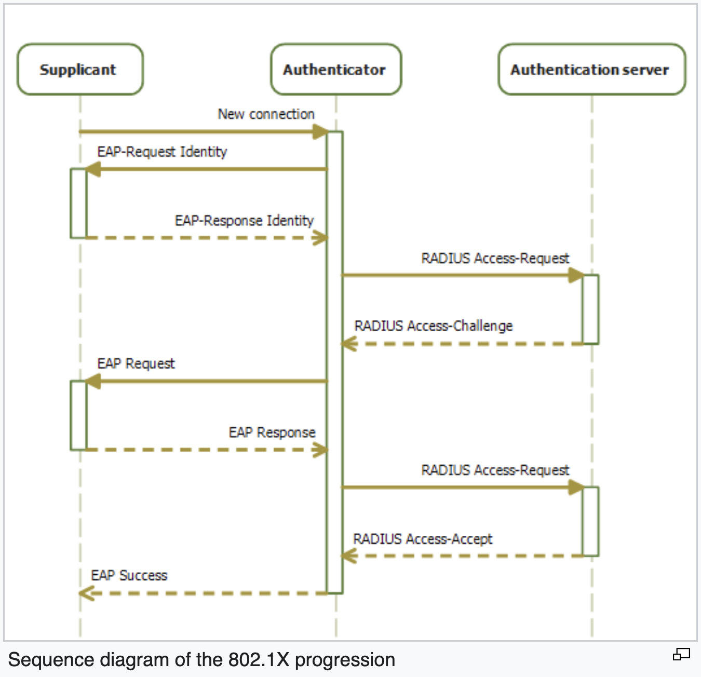

Network references: [Computer Network Tutorial - GeeksforGeeks](https://www.geeksforgeeks.org/computer-network-tutorials/)

- Nodes: devices connected to a network. PC, Server, Printer, Router, Switches

- Topology: The physical and logical arrangement of nodes on a network

- QoS: Quality-of-Service - A set of technologies that work on a network to guarentee its ability to dependably run high-priority applications and traffic under limited network capability

- Basic Service Set (BSS) : It is basically a network topology that allows all wireless devices to communicate with each other through a common medium i.e. AP (Access point). BSS basically contains only one AP that is connected to all stations i.e. all wireless devices within the network. Here, AP is a common access point that acts as a medium and creates [WLAN (Wireless Local Area Network)](https://www.geeksforgeeks.org/wlan-full-form/). 

- AID: Association ID. A 16-bit field in 802.11 frame, identifies a STA that is associated with an AP.

- Independent Basic Service Set (IBSS): A wireless network that does not use an AP, but allows devices to communicate directly with each other in a peer-to-peer manner. Also called ad-hoc network.

- Wireless Distribution System (WDS): It allows multiple APs to communicate with each other wirelessly. [Wireless distribution system - Wikipedia](https://en.wikipedia.org/wiki/Wireless_distribution_system)

- Mesh vs. WDS: [Maui Communications Networks - Mesh Routing and WDS Discussion (hawaiian-study.info)](https://www.hawaiian-study.info/mesh-routing-and-wireless-distribution) , [Mesh and WDS - Huawei Enterprise Support Community](https://forum.huawei.com/enterprise/en/mesh-and-wds/thread/756215-861)

- 802.1X: A standard for port-based network access control (PNAC). It provides an authentication mechanism to devices wishing to attach to LAN or WLAN. It uses the Extensible Authentication Protocol (EAP) to exchange authentication message between a device (supplicant, it provides credentials to the authenticator), an AP or switch (authenticator), and an authentication server (usually RADIUS). It can restric access based on an individual's role or permissions.

  

- SAE - Simultaneous Authentication of Equals: A password-based authentication and key agreement method for 802.11 wireless networks. It is based on Diffie-Hellman key exchange using finite cyclic groups

- SAE is a security protocol for Wi-Fi networks that uses passwords to authenticate devices. The protocol results in a PMK shared between the two devices that want to communicate.

- Keying dialog: A communication process that involves exchanging cryptographic keys between two parties 

- PMK - Pairwise Master Key: A key that is derived from a pre-shared key (PSK) or an authentication server (EAP) in 802.11 wireless networks. It is used to generate a Pairwise Transient Key (PTK) that encrypts the data frames between a client and an AP.
  The PMK is unique for each device and is derived from the passwords. The PMK is used to generate session keys for secure data transmission.

- PMK exchange : The process of establishing a PMK between a client and an AP. WPA security protocol uses the PMK exchange

- AAA server reachability: The ability of a network device to communicate with an AAA server (Authentication, Authorization and Accounting) that provides security services such as user authentication and authorization. It is important for ensuring that only authorized users can access the network resources.

- Unicast Vs Multicast:

  Unicast traffic is traffic that is meant for a single host on a network. It is a one-to-one transmission from one sender to one receiver, each identified by a network address. For example, when you visit a website, you establish a unicast connection with the web server. Unicast traffic is the most common type of data transmission on the internet.

  The difference between unicast and multicast is that multicast is a one-to-many transmission from one sender to multiple receivers, who belong to a group of hosts that share a common multicast address. For example, when you watch a live video stream, you receive multicast traffic from the video server along with other viewers. Multicast traffic is more efficient than unicast traffic for applications that involve simultaneous data delivery to multiple hosts. However, multicast traffic also requires more network resources and protocols to manage the group membership and routing of the packets.

- HT control field: A 4-octet field in Wi-Fi frame that use the High Throughput(HT) or Very High Throughput(VHT) PHYs

- PHY: A physical layer device that connects a data link layer device (such as a MAC) to a physical medium (such as optical fiber or copper wire). It is responsible for sending and receiving bits at a certain speed, called PHY rate

- MAC layer: Medium Access Control layer is a sub-layer of the data link layer. It is responsible for controlling how devices access and share a common communication medium, such as a cable or wireless channel. It also performs flow control and multiplexing for data transmission

- MAC address: a unique identifier assigned to a network interface controller (NIC) of a device. It is used as a network address for data transmission within a network segment, such as Ethernet, Wi-Fi, Bluetooth

- Timestamp in 802.11 frames is 8 bytes long, the accuracy is 1ms

- HT control field: A 4-octet field in Wi-Fi frame that use the High Throughput(HT) or Very High Throughput(VHT) PHYs

- PHY: A physical layer device that connects a data link layer device (such as a MAC) to a physical medium (such as optical fiber or copper wire). It is responsible for sending and receiving bits at a certain speed, called PHY rate

- Switch, router and bridge: reference: [Network Devices (Hub, Repeater, Bridge, Switch, Router, Gateways and Brouter) - GeeksforGeeks](https://www.geeksforgeeks.org/network-devices-hub-repeater-bridge-switch-router-gateways/)

  - A switch is a device that can connect multiple devices within a single network and forward data packets between them, based on the MAC address of the device. A switch can also divide a network into smaller segmentsto reduce congestion and improve performance. reference: https://www.geeksforgeeks.org/difference-between-switch-and-bridge/
  - A router is a device that connects multiple networks together and forwards data packets between them. It can connect multiple networks that use different protocols and forward data packets based on the IP address of the destinaton. A router can also perform NAT, firewall and routing functions. 
  - A bridge is a device that can connect two networks that use the same protocol and forward data packets based on the MAC address of the destination. A bridge can also filter traffic and prevent collisions between networks

- Frame collision in wireless network: A situation where two or more devices try to transmit data at the same time on the same channel, causinng interference and corruption of the data. Unlike wired networks, wireless devices cannot detect collisions directly, so they use a mechanism called Carrier Sense Multiple Access with Collision Avoidance (CSMA/CA) to avoid collisions. CSMA/CA involves sending a Request to Send (RTS) frame before transmitting data, and waitting for a Clear to Send (CTS) frame from the receiver. If no CTS is received, the sender assumes there was a collision and tries again after a andom back-off time

- Medium reservation: the allocation of a certain amount of time or bandwidth for a device to transmit data without contension or interference from other devices

- DHCP - Dynamic Host Configuration Protocol: A protocol that automatically assigns IP address and network configuration settings to devices on a network.

