> 本文翻译、删改自：[How To Add Route on Linux – devconnected](https://devconnected.com/how-to-add-route-on-linux/)
>
> 若觉得本译文中缺了什么东西，请自行参考原文，不再单独标出

本教程中所有的命令都需要使用 root 执行。

## 使用 ip 添加路由

这是最简单的方式。

```
$ ip route add <network_ip>/<cidr> via <gateway_ip>

# 例：
$ ip route add 10.0.3.0/24 via 10.0.3.1
```

`<network_ip>/<cidr>` 是希望能到达的网络，`<gateway_ip>` 是这条路由所使用的网关。若不指定所用的网卡设备，则会自动选择电脑上的第一个网卡（不包括 loopback）。若要指定设备，可以在命令后面指明：

```
$ ip route add <network_ip>/<cidr> via <gateway_ip> dev <network_card_name>
```

这里用连通两个 LAN 来举例：本网络拓扑中有三个 Linux 主机：

- IP 地址为 `10.0.2.2/24` 的 Ubuntu 主机
- IP 地址为 `10.0.3.2/24` 的 Ubuntu 主机
- 作为上述两个主机所在网络的路由器的 RHEL8 主机

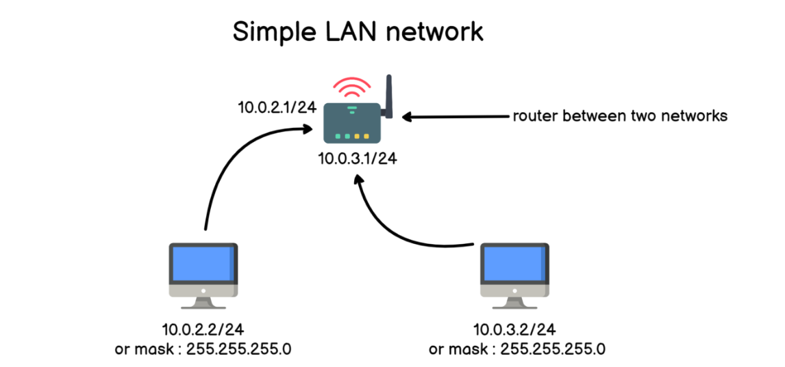

由于这两个 Ubuntu 主机在不同的子网中（10.0.2.0 和 10.0.3.0），而它们的 ping 命令又是通过各自的默认网关向外发出请求，因此两个主机目前并不能 ping 通。

要查看当前主机（10.0.2.2）的路由，可以使用 `ip route` （或简写为 `ip r` ）

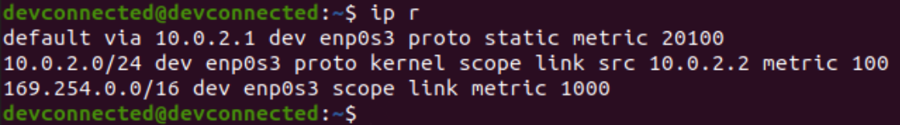

> 译注：
>
> `dev enp0s3` 指本条路由对应的网卡设备
>
> `proto` 指协议 "protocol"，代表该条路由的路由协议（routing protocol）。其通常有如下几个值：  
> \- redirect - 该路由是由 ICMP 重定向添加的  
> \- kernel - 该路由是在自动配置（autoconfiguration）时，由内核添加的  
> \- boot - 该路由是在启动过程中配置的，会在路由守护进程（routing daemon）启动时清除  
> \- static - 该路由是由系统管理员手动添加的，会覆盖动态路由（dynamic routing）。路由守护进程将按照它们的值运行，而且可能会把这些路由发给 peers  
> \- ra - 该路由是由路由发现协议（Router Discovery protocol）添加的
>
> `scope` 指本条路由到达目的地网络的距离  
> \- host - 该条路由的目的地地址为 localhost  
> \- link - 该条路由的目的地地址为本地网络（local network）  
> \- universe - 该条路由的目的地地址在一跳之外（one hop away）
>
> `src` 指使用本条路由发送数据时要经由的网络接口 IP 。这里的意思是说发往 10.0.2.0/24 网络的包都会从 10.0.2.2 地址的网卡发出。设置方式例如：  
> `ip route add 78.22.45.0/24 via 10.45.22.1 src 10.45.22.12 `  
> 这样新创建的路由就是：经由 10.45.22.1 发往 78.22.45.0/24 网络的数据包，都会从 10.45.22.12 地址的网卡发出。但注意这只能影响真正发出这个包的主机，无法影响转发——毕竟帮别的主机转发包，肯定不能把人家 IP 包里的源地址给改了（当然 NAT 就是完全另外一回事了）

这个就是 Linux 系统的路由表，每个电脑都有一个。路由器会管理很多的路由。

接下来我们一条一条看看这三条路由

- **默认** 情况下，对网络发出的数据会被转发到本地默认网关 `10.0.2.1`
- **除非** 数据是发往 `10.0.2.0/24` 网络的。如果是，则通过默认物理链路发送（比如 CAT 网线）到本地网络
- **除非** 数据是发往 `169.254.0.0/16` 网络的。如果是，则将通过默认物理链路发送到本地网络

> 169.254.0.0/16 地址被称为 APIPA （用于自动 IP 地址寻址 - Automatic IP Address Addressing）。这是系统在无法连接到网络上 DHCP 服务器时使用的默认地址

在 10.0.2.2 主机当前的路由配置下（也就是上面图中的），要发往 10.0.3.2/24 的数据都会被转发给 10.0.2.1 路由器

然而，这个路由器会把我们发过去的数据再转发到 10.0.3.0/24 网络吗？

在路由器上执行一下 `ip r` 即可知道答案：

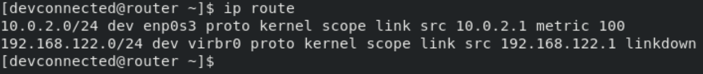

这里只有到 10.0.2.0/24 网络的路由，显然是有问题的。因此我们需要添加路由规则

```
$ ip route add 10.0.3.0/24 via 10.0.3.1
```

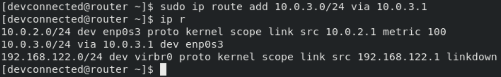

现在再 ping 就应该能通了

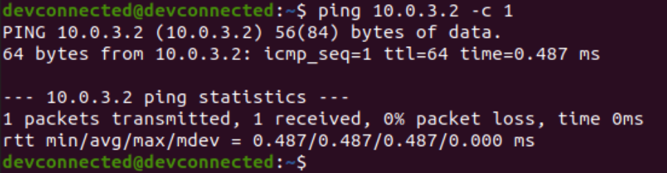


## 在 Ubuntu 上配置永久路由

有三种方式：

- 将新路由添加进 NetworkManager 配置文件
- 添加进 Netplan YAML 配置文件
- 添加进 `/etc/network/interfaces` 配置文件（较老版本系统）

### NetworkManager

修改 `/etc/NetworkManager/system-connections` 目录下的连接文件。该文件下会有以当前系统中网络接口命名的配置文件

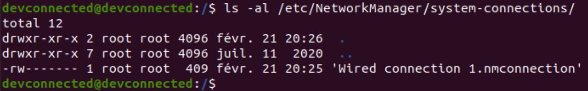

在网络配置文件的 IPv4 部分添加一个 `route1` 属性

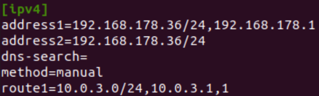

使用下面的命令来让设置生效

```
$ nmcli connection reload
```

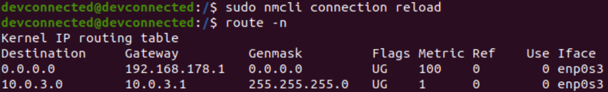

### Netplan

Netplan 是一个 ubuntu 独占的工具，但用起来很简单

打开对应的配置文件

```
$ sudo vi /etc/netplan/<configuration_file>.yaml
```

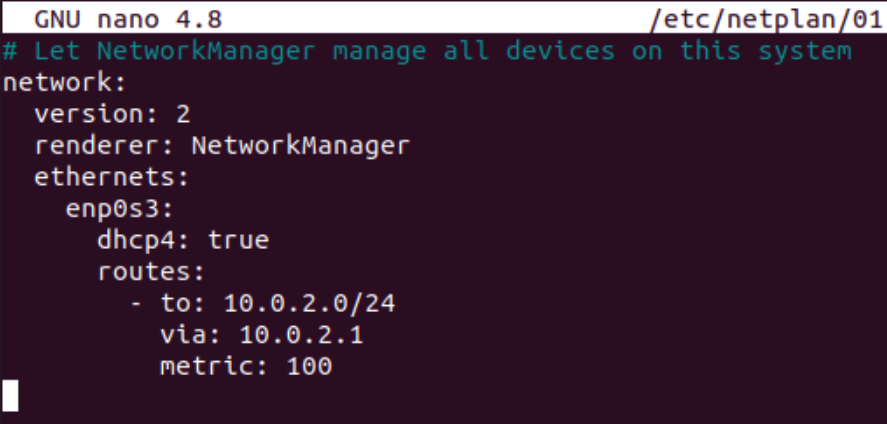

### /etc/network/interfaces

如果发行版使用的是 ifup 和 ifdown 管理网络接口，那么可以修改 `/etc/network/interfaces` 文件来添加路由：

```
$ sudo vi /etc/network/interfaces

auto eth0
iface eth0 inet static
      address 10.0.2.2
      netmask 255.255.255.0
      up route add -net 10.0.3.0 netmask 255.255.0.0 gw 10.0.2.1
```


## 在 RHEL / CentOS 上添加永久路由配置

需要在 `/etc/sysconfig/network-scripts` 目录中创建一个名为 `route-<device>` 的配置文件

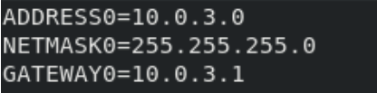


## 使用 nmcli

```
$ sudo nmcli connection modify <interface_name> +ipv4.routes "<network_ip> <gateway_ip>" 
```

> NetworkManager 的完成教程，参阅：[Network Manager on Linux with Examples – devconnected](https://devconnected.com/network-manager-on-linux-with-examples/)

例如，添加一条上文中讲过的路由：

```
$ sudo nmcli connection modify enp0s3 +ipv4.routes "10.0.3.0/24 10.0.3.1"
```

执行下面的命令生效：

```
$ sudo nmcli connection reload
```

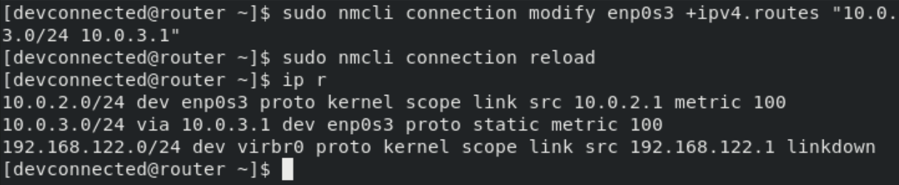


## 解决互联网连接问题

假设你用来连接互联网的路由器是 192.168.178.1/24

检查当前的路由表，就很容易猜出来无法连接网络的原因了。思路如下：

- 要到达的 IP 在我当前的子网内吗？
- 若在，则不用通过路由器就能访问，ARP 和以太网就能实现了
- 若不在，则需要确保自己的电脑有能够到达联网路由器的路由

首先要理出你所在网络的架构，如下图

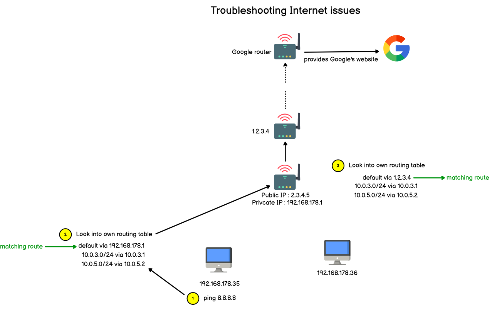

无论解决什么网络连接问题，都可以从路由下手：我的电脑有没有到达目标电脑的路由？

在我和目标地址之间的计算机和路由器，都有没有正确配置为可以为我进行路由？

如果能够到达目标地址，那这个目标地址发回来的信息能否到达我的电脑？

能够解决这些问题，网络连接基本也就没问题了


