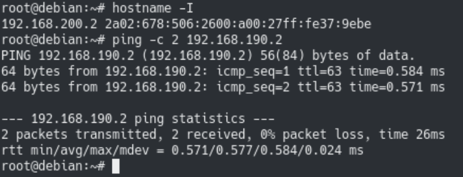

[How To Configure Linux as a Static Router – devconnected](https://devconnected.com/how-to-configure-linux-as-a-static-router/)


本教程中所有的命令都需要使用 root 执行。

在开始配置前，需要先完成下面三步：

- 需要对当前的网络架构有整体认知：网络中都有哪些 IP 地址，以及有哪些网络需要相互通信
- 需要再 Linux 路由器上配置静态路由表（static routing table）
- 需要为发往内网的数据包启用 IP 转发（IP forwarding）

## 理解网络架构

简单起见，我们将配置一个简单的连通两个网络的静态路由。两个网络分别是 `192.168.200.0/24` 和 `192.168.190.0/24` 。我们在两个网络中选两个 host 分别为 `192.168.200.2/24` 和 `192.168.190.2/24`。这俩 host 并不属于同一个子网，当然也就无法直接通信。

## 配置路由器网络接口（Network Interfaces）

想要能够将数据包从一个网络路由到另一个网络，路由器必须有两个网络接口，每个接口连接一个网络。为简化本教程的难度，我们假设两个子网中的这两个 host 都使用该路由器作为自己网络的默认网关。也就是说第一个 host 连接到的路由地址为 `192.168.200.1/24` ，第二个连接到的路由地址为 `192.168.190.1/24`

首先，需要确认用于进行路由的网络接口

```
$ ip link show
```


该设备上的两个网络接口分别为 `enp0s3` 和 `enp0s8` 。最好把这两个值记下来，后面会用到

### 在 Debian 或 Ubuntu 上配置静态 IP 地址

在 debian 或 ubuntu 上，通过修改 `/etc/network/interfaces` 来配置网络接口信息

```
$ sudo nano /etc/network/interfaces

# 定义第一个接口
auto <接口名>
iface <接口名> inet static
address 192.168.190.1
netmask 255.255.255.0

# 定义第二个接口
auto <接口名>
iface <接口名> inet static
address 192.168.200.1
netmask 255.255.255.0
```

注意不要忘记 `auto` 指令。否则接口不会在系统开机时自动启动。

然后重启网络服务

```
$ sudo systemctl restart networking.service

$ sudo systemctl status networking.service
```

这里使用了 ifupdown 工具来管理接口，并没有使用 NetworkManager 。重启服务后，就可以使用 `ip a` 来检查这两个接口的情况了。如果接口还是 `DOWN` 状态，则可以使用 `ifup` 来手动启动：

```
$ ifup <接口名>
```

### 在 CentOS 上配置静态 IP 地址

在 CentOS 上配置静态地址，需要在 `/etc/sysconfig/network-scripts` 目录中创建两个为网络接口准备的配置文件

```
$ touch ifcfg-enp0s3 && touch ifcfg-enp0s8
```

在两个文件中分别进行配置

```
# enp0s3 的内容

BOOTPROTO="static"
IPADDR=192.168.200.1
NETMASK=255.255.255.0
NAME="enp0s3"
ONBOOT="yes"

# enp0s8 的内容
BOOTPROTO="static"
IPADDR=192.168.190.1
NETMASK=255.255.255.0
NAME="enp0s8"
ONBOOT="yes"
```

注意不要忘记 `ONBOOT` 指令。否则接口不会在系统开机时自动启动。

这样，连接到两个网络的静态路由器就准备好了。

## 使用 ip 创建静态路由

现在我们拥有两个网络接口，但内核并不会因此就自动地将一个接口的数据包发往另一个接口。

首先，使用 `ip route` 来列出路由器设备上已经有的路由

```
$ ip route
```


### 删除已有的静态路由

如果网络接口上已经定义过了静态路由，则需要先删掉，否则无法添加新的静态路由。

删除路由：

```
$ ip route delete <route>
```

在当前的例子中，需要删掉指向 `192.168.190.0/24` 和 `192.168.200.0/24` 网络的路由

```
$ ip route delete 192.168.190.0/24

$ ip route delete 192.168.200.0/24

$ ip route
```


这样就可以按照需求来添加新的路由了

## 新建静态路由

想让数据包能从第一个网络跑到第二个网络，就需要将两个网络接口互相指向对方。

首先，创建一个从第一个网卡 IP 到第二个网络的 IP 地址

```
$ ip route add 192.168.200.0/24 via 192.168.190.1
```

有了这条规则，所有经由 192.168.190.1 网卡进入到路由器的数据包（对于发出这些数据包的主机来说，该网卡就是它的网关），都会被重定向（redirect）至 192.168.200.0 网络

与此类似，还可以再添加一个相反方向的路由，以确保回来的数据包能够正常通过

```
$ ip route add 192.168.190.0/24 via 192.168.200.1
```

可以使用 `ip route` 来查看当前的路由

```
$ ip route
```


到这里，距离连通网络就只剩下最后一步了

## 启用 Linux 的 IP 转发（IP forwarding）

虽然已经配置过了路由，但 Linux 内核并不会因此就自动地把数据包从一个接口转发到另一个接口。我们还需要配置 IP 转发

要启用 IP 转发，我们需要到 `/etc/sysctl.conf` 文件来配置 `net.ipv4.ip_forward` 参数

```
$ vi /etc/sysctl.conf
```

该参数默认为 0，我们需要把它改为 1


保存，再使用下面的命令更新系统配置

```
$ sysctl -p /etc/sysctl.conf
```


## 测试网络连通性

可以通过 ping 另一个网络中的主机来进行测试

```
$ ping <另一个网络中的主机>
```



搞定了，恭喜


