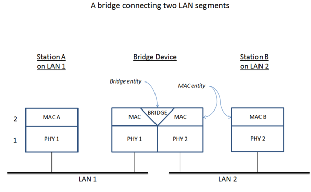

[Chapter 6. Configuring a network bridge Red Hat Enterprise Linux 8 | Red Hat Customer Portal](https://access.redhat.com/documentation/en-us/red_hat_enterprise_linux/8/html/configuring_and_managing_networking/configuring-a-network-bridge_configuring-and-managing-networking)

[debian - Setting up a wifi hotspot with brctl and hostapd - Super User](https://superuser.com/questions/709879/setting-up-a-wifi-hotspot-with-brctl-and-hostapd)

[BridgeNetworkConnections - Debian Wiki](https://wiki.debian.org/BridgeNetworkConnections)

网桥（Network bridge）是一个根据 "MAC 地址表" (MAC address table) 来在网络间转发流量的链路层设备。网桥通过监听网络流量来构建自己的 MAC 地址表，并了解每个网络中都连接了哪些主机。例如，你就可以在 RHEL 主机或虚拟化环境里建立一个虚拟的硬件网桥，实现将一堆虚拟机（VMs）接入到与主机（host）相同的网络中。

网桥需要与每个网络中的网络设备都建立连接。在配置网桥时，网桥叫做 `controller`，连接到网桥的设备使用网桥的 `ports`。

网桥和路由并不相同——路由能让多个网络互相通信，但这些网络之间彼此相互独立。桥接让两个网络看起来像是一个网络

[How do I configure a network interface bridge from WiFi to Ethernet with Debian? - Unix & Linux Stack Exchange](https://unix.stackexchange.com/questions/363332/how-do-i-configure-a-network-interface-bridge-from-wifi-to-ethernet-with-debian)
