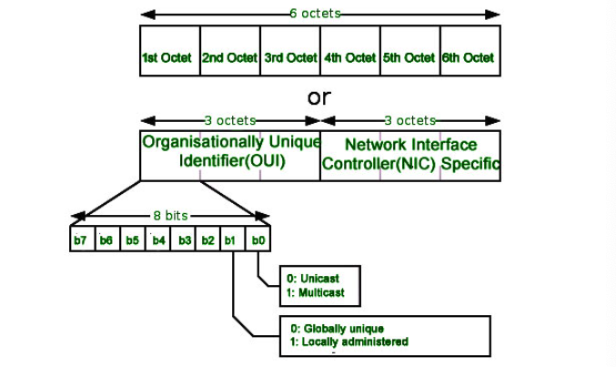
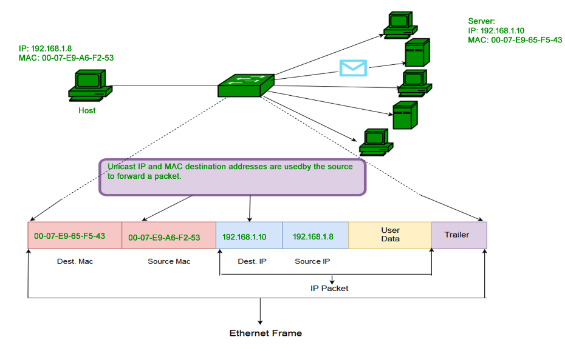
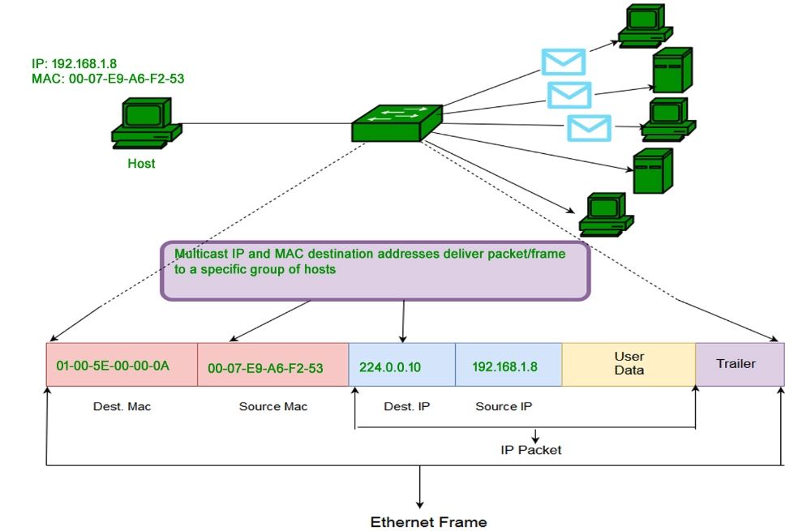

# MAC 地址

> 本文主要内容翻译、删改自 [Introduction of MAC Address in Computer Network - GeeksforGeeks](https://www.geeksforgeeks.org/introduction-of-mac-address-in-computer-network/)

在计算机网络中的每一层都要用到不同的地址，MAC - Media Access Control 地址是一个物理层地址，其工作于数据链路层

MAC 地址是一个 48 位长的网卡硬件标识数字，该值在世界范围内唯一，由网卡厂商在生产时写入。MAC 地址还被称为网络设备的物理地址。在 IEEE 802 标准中，数据链路层（Data Link Layer）被分为两个子层：

1. 逻辑链路控制子层（Logical Link Control, LLC Sublayer）
2. 媒体访问控制子层（Meida Access Control, MAC Sublayer）

MAC 地址就属于数据链路层中的媒体访问控制子层

### MAC 地址格式

MAC 地址用 12 个 16 进制数表示。前 6 个数字用于识别厂商（OUI，Organizational Unique Identifier，由 IEEE 为厂商分配）；后 6 个数字表示 Network Interface Controller，由厂商分配。

### MAC 地址类型

1. 单播（Unicast）：单播地址帧仅发送到指定的 NIC 。若地址的第一个 byte 的 LSB（Least Significant Bit）被设置为 0，就意味着这个帧只会被发到一个 NIC 。源设备的 MAC 地址总是单播的

   

2. 组播（Multicast）：组播地址允许源将一个帧发给一组设备。在 L2 （Ethernet）Multicast 地址中，第一个字节中的 LSB 会被设置为 1。IEEE 已经将 01-80-C2-xx-xx-xx 段内的地址都分配给了标准协议

   

3. 广播：与网络层类似，数据链路层也支持广播。 Ethernet 帧中目的地地址全为 F 的地址就是广播地址，这样的帧会被发往属于对应 LAN 段的所有计算机

### MAC 地址克隆

某些 ISP 使用 MAC 地址来为网关设备指定 IP 地址。当一个设备连接到 ISP 时，DHCP 服务器就会记录 MAC 地址并为设备分配 IP 地址，然后系统就能被通过 MAC 地址识别了。当设备断开连接时，它就会失去自己的 IP 地址。当设备想要重新连接时，DHCP 服务器会检查设备之前是否连接过当前网络，若连接过就会尝试为其分配之前用过的 IP 地址。若用户更换了路由器，用户就需要告知 ISP 新的 MAC 地址，因为 ISP 不知道新的 MAC 地址，也就不能建立连接。当然还有另一个办法，就是克隆（cloning）。用户可以把之前在 ISP 注册过的 MAC 地址克隆到新的路由器上，就不会再有连接问题了。

### MAC 地址的特点

MAC 地址是一个扁平结构，无法直接在互联网上路由，仅能用于将数据帧发往目标设备。

- MAC 地址仅在 LAN 环境下用于识别设备和通信
- MAC 地址是被烧入 NIC 、无法修改的，除非厂商提供了专用的工具
- 前三字节用于表示厂商，后三字节由厂商用来标记设备
- MAC 地址常被用于接入 ARP （Address Resolution Protocol），ARP 用于在 LAN 通信中把 IP 地址转为 MAC 地址

